# Claude Code 橙皮书

> 一本面向零基础读者的 Claude Code 中文完全教程。覆盖 CLI（命令行）与 Desktop（桌面应用）两种使用模式，从安装配置到高级功能，从概念原理到实战项目。

---

## 0. 使用说明

### 0.1 重要声明

- 本资料为非官方指南，不代表 Anthropic官方文档。
- 所有功能以 Anthropic 官方文档和 Claude Code 实际版本为准。
- 本 PDF 会随着 Claude Code 更新持续维护。
- 建议读者优先查看 GitHub 仓库中的最新版 Markdown 原稿。

### **0.2 这份教程适合谁** 

- 零编程基础新手
- 轻度编程经验的 AI 工具用户 
- 想从 Cursor/Copilot/Codex 迁移的开发者

### **0.3 阅读路线** 

三条推荐路径：

  - 🟢 **快速上手路线**：第 0 章 → 第 1 章 → 第 2 章 → 第 3 章 → 第 4 章 → 第 5 章 → 附录 A
  - 🟡 **系统学习路线**（逐章阅读）：适合想完整掌握所有功能的读者
  - 🔴 **进阶扩展路线**：第 7 章 → 第 8-15 章 → 附录，适合已入门、想深入定制的用户
  
### **0.4 本文的格式约定**
  💡「简单来说」— 用大白话解释复杂概念
  ⚠️「注意」— 踩坑预警，重点关注
  🖥️「CLI 方式」/ 🖼️「Desktop 方式」— 两种模式的分轨操作
  📋「提示词模板」— 可直接复制使用的 prompt
  🔰「新手建议」— 给零基础读者的额外指引

---

# 第一章：入门篇 — 认识 Claude Code

> **本章定位**：基础启蒙第一课。不讲操作、不装软件，先搞懂 Claude Code 到底是什么、为什么厉害、能帮你做什么。读完这章，你会对 CC 有一个完整的心智模型。
>
> **预计阅读时间**：15 分钟

---

## 1.1 你熟悉的 AI vs Claude Code

> 💡 **一句话定位**：Claude Code 不是代码补全工具，也不是 AI 聊天机器人——它是一个**运行在终端里的项目级 AI 工程助手**。
> 
> 它能读懂你整个项目、自己做计划、动手改代码、执行命令、检查结果，直到把活干完。

2022 年底，ChatGPT 横空出世。

三年多过去了，我们每个人对这种 AI 的用法都很熟悉了——你问一句，它答一句。你觉得答得不好，换个问法再问一次。

这种「一问一答」的模式，帮你查资料、写文案、翻译文字都没问题。但遇到真正需要「干活」的事情，它就无能为力了。

这就是 **AI 聊天机器人** 和 **AI 智能体（Agent）** 的本质区别。

**💡「简单来说」：** 聊天 AI = 只动嘴的军师，Agent = 能自己动手干活的助手。

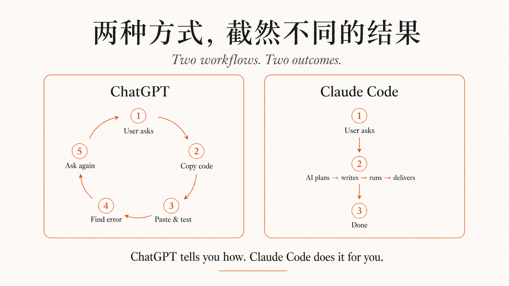

---

## 1.2 Agent 的秘密：大模型循环

Claude Code 为什么能做到「自己干活」？我们来拆解它的核心机制。

### 大脑 + 手脚 = Agent

要理解 Claude Code，你先认识三个角色：

| 角色 | 是什么 | 能干嘛 | 举例 |
|------|--------|--------|------|
| **大模型（LLM）** | AI 的大脑 + 眼睛 | 理解你的需求、观察环境、做出决策 | "我应该先创建一个 HTML 文件" |
| **工具（Tools）** | AI 的手脚 | 读写文件、搜索网络、执行命令、调用服务 | 真的在你的电脑上创建一个文件 |
| **Agent 程序** | 连接大脑和手脚的神经系统 | 把大模型的决策翻译成工具调用，再把结果反馈给大模型 | Claude Code 本身 |

🔰「新手建议」：你不用记住所有工具的名字——现在只需要理解这个「大脑指挥手脚干活」的比喻就够了。

### LLM Loop：AI 的工作循环

普通聊天 AI 是这样工作的：

```
你提问 → AI 回答 → 结束
```

Claude Code 是这样工作的：


这个过程就叫 **LLM Loop（大模型循环）**。它让 AI 从「一问一答」变成了「持续干活」。

### 为什么 Claude Code 特别聪明？

市面上有很多 Agent 产品，但 Claude Code 的循环设计得特别出色。用一个比喻：

- **普通 Agent** = 实习生。你推他一步，他走一步。推得不明确，他就停了。
- **Claude Code** = 成熟的职场人。你给他一个目标，他自己规划步骤、调用工具、执行操作、检查结果。卡住了？他会自己上网搜索找解决方案。遇到报错？他会自己 Debug。

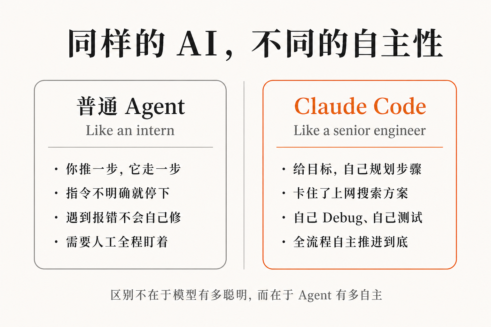

这就是「自主决策循环」：**感知环境 → 推理决策 → 调用工具 → 评估结果 → 继续循环**。整个过程你只需要在开始说一句话，中间最多点几次「同意」。

---

## 1.3 Claude Code 和别的工具有什么不同

市面上 AI 编程工具不少，我们来对比一下，帮你快速建立坐标系。

### **Claude Code 与 Copilot 的区别**

很多人会问：既然 Copilot 也能帮我写代码，为什么还要用 Claude Code？

核心区别在于：Copilot 更像一个**贴身助理**——你写代码时它在旁边看着，猜你接下来要写什么，帮你补全。但 Claude Code 更像一个**外包团队**——你把整个需求丢给它，它自己规划、写代码、跑测试、修 Bug，最后交给你一个能用的东西。

Copilot 适合帮你**写得快**。

Claude Code 适合帮你**做完事**。

更合理的用法是：日常编码用 Copilot 提效，复杂项目或从零开发时用 Claude Code 完整交付。
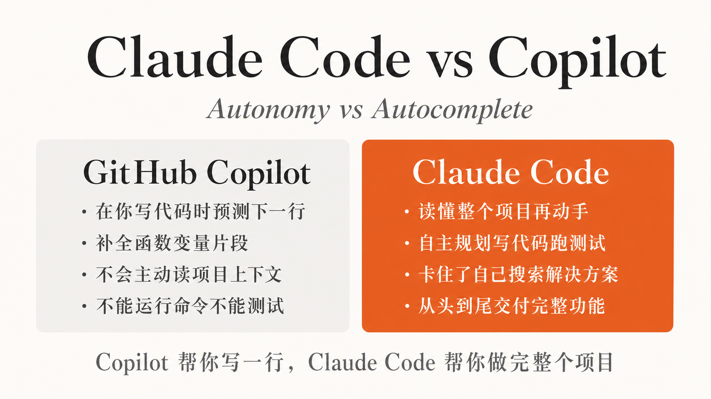

### **Claude Code 与 Cursor 的区别**

很多人会问：Cursor 不也能在编辑器里跟 AI 对话改代码吗，CC 有什么不同？

核心区别在于：Cursor 更像一个**会 AI 的编辑器**——你在编辑器里写代码，AI 帮你改、帮你补、帮你解释。但 Claude Code 更像一个**会用编辑器的 AI**——它不依赖你手动打开文件、选中代码，你只需要说目标，它自己决定要改哪些文件、执行什么命令。

Cursor 适合**你在写代码时辅助你**。

Claude Code 适合**你不用写代码时替代你**。

更合理的用法是：用 Cursor 做轻量编辑和代码审查，用 Claude Code 做重度开发和完整项目交付。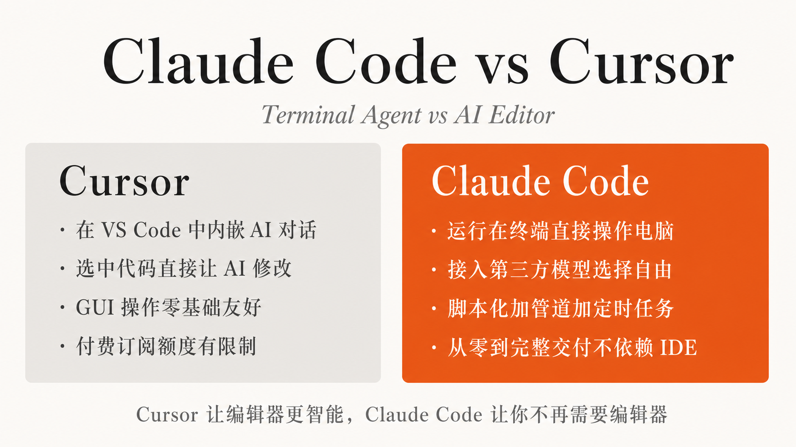

### **Claude Code 与 Codex 的区别**

很多人会问：Codex 也是命令行 Agent，也能自主干活，和 CC 有什么不同？

核心区别在于：Codex 更像 OpenAI 生态里的**工程助手**——它背后是 GPT 系列模型，深度绑定 OpenAI 的工具链。而 Claude Code 更像 Anthropic 生态里的**长期工程伙伴**——它不仅有 Claude 模型驱动，还有更成熟的 Harness 设计、更丰富的 Skills/Hooks/Plugins 生态，以及更灵活的模型接入（支持第三方）。

Codex 适合**已经在 OpenAI 生态中的开发者**。

Claude Code 适合**想要最成熟 Agent 体验、不想被单一模型绑定的用户**。

更合理的用法是：如果你已经深度使用 OpenAI 全家桶，Codex 是不错的延伸；如果你想体验当前最强的 Agent 驾驭系统，Claude Code 是更好的选择。


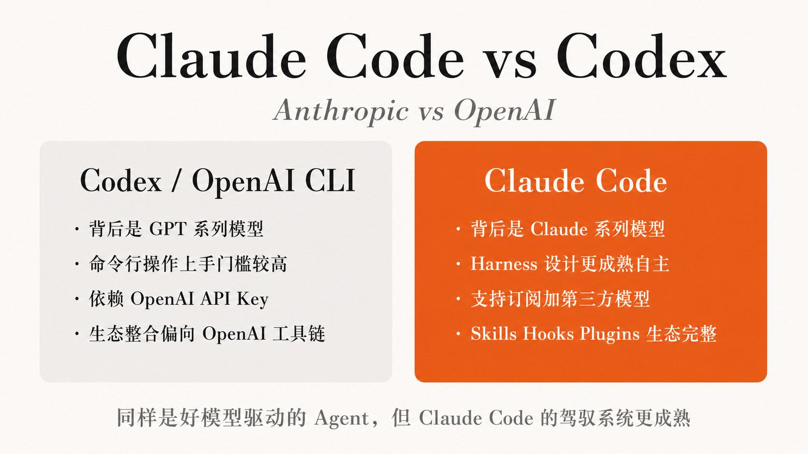

| 工具                     | 一句话概括               | 收费      | 强项                  | 弱项            |
| ---------------------- | ------------------- | ------- | ------------------- | ------------- |
| **GitHub Copilot**     | 代码自动补全插件            | 付费      | 在你写代码时智能预测下一行       | 只能补全，不能自主干活   |
| **Cursor**             | AI 增强版 VS Code      | 付费      | 在编辑器内对话 + 改代码，体验流畅  | 付费额度有限制       |
| **Codex / OpenAI CLI** | OpenAI 的命令行 Agent   | 付 API 费 | 背后是 GPT 系列模型        | 使用门槛较高        |
| **Claude Code**        | Anthropic 的终端 Agent | 订阅或 API | 自主干活能力最强，harness 最好 | 终端界面，小白上手需要适应 |

💡「简单来说」：Copilot 帮你写一段代码，Cursor 帮你改一个文件，Claude Code 帮你做完整个项目。

🔰「新手建议」：不用纠结「我该用哪个」——这本书就是教你用好 Claude Code 的。掌握它之后，其他工具你也能很快上手。

---

## 1.4 为什么是「Harness 的集大成者」

你可能听过一个词——**Harness（驾驭系统）**。

用大白话解释：Harness 就是 Agent 这个「身体」的设计水平。同样的大脑（大模型），装在不同的身体里，表现天差地别。

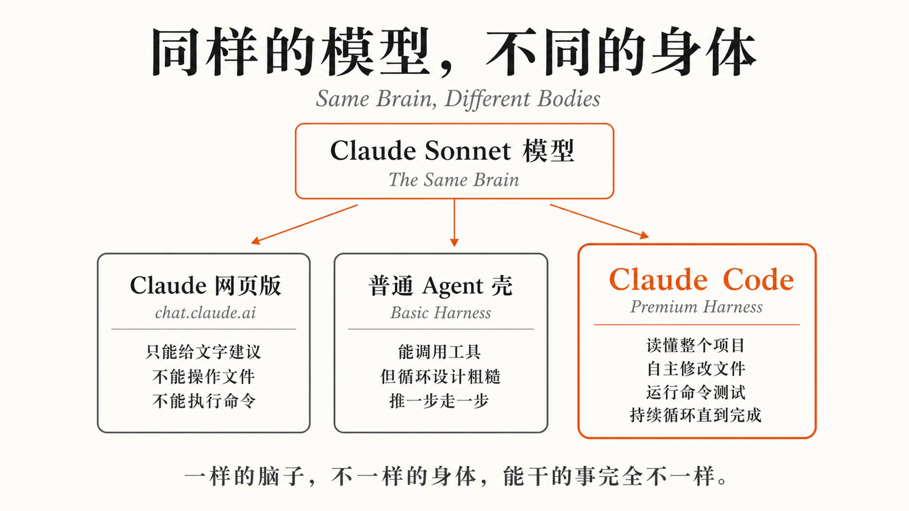

举个例子：同样是调用 Claude Sonnet 模型：

- 你在 **Claude 网页版**里问它 → 它只能给你文字建议
- 你通过 **Claude Code** 调用同一个模型 → 它能读你的整个项目、修改文件、运行命令、测试结果

一样的脑子，不一样的身体，能干的事完全不一样。

Claude Code 的 Harness 设计好在哪？几个关键点：

- 🔄 **自主循环**：不是推一步走一步，而是自己持续推进直到任务完成
- 📂 **终端原生**：直接运行在你的电脑上，不受浏览器沙箱限制
- 🧠 **超长上下文**：能记住整个项目的来龙去脉，不会做着做着「失忆」
- 🛡️ **权限清晰**：什么操作要问你、什么可以直接做，边界分明
- 🧩 **官方 Skill**：Anthropic 团队提前设计了大量开箱即用的技能包

🔰「新手建议」：不用深究 Harness 这个词。你只需要知道——Claude Code 不只是给大模型套了个壳，它的「身体」经过精心设计，这才是它真正厉害的地方。

---

## 1.5 Claude Code 能做什么

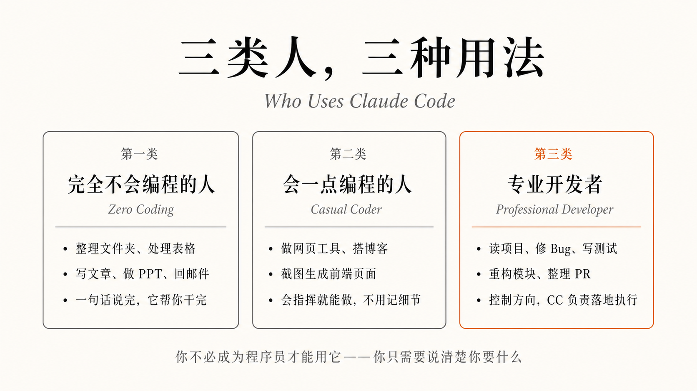

知道了 Claude Code 的原理，你可能会想：它具体能帮我干什么？

使用 Claude Code 的人大致分三类，每一类用它做完全不同的事。

**第一类：完全不会编程的人**

这群人用 CC，不是为了写代码，是为了**省掉重复劳动**。对他们来说，CC 就是一个「能操作电脑的 AI」。

他们用它做的事包括：

- 整理文件夹：批量重命名、分类归档、删除重复文件
- 处理表格：合并 Excel、筛选数据、生成图表
- 写东西：公众号文章、周报、邮件、PPT 大纲
- 搜资料：总结网页内容、对比多篇文章、提取关键信息
- 设置提醒：定时任务、自动检查、格式校验

🔰「新手建议」：如果你是这一类，不用学任何编程知识。你只需要学会两件事——怎么把文件放到 CC 能看到的文件夹里，以及怎么用自然语言说清楚你要什么。

---

**第二类：会一点编程，但不想什么都自己写**

这群人可能是学生、设计师、产品经理，或者自学过一点前端。他们能用 CC **加速自己本来就做得到的事**，做那些「会做但懒得做」的工作。

他们用 CC 的典型场景：

- 做一个网页工具（番茄钟、倒计时、表单收集）
- 写一个数据爬虫脚本
- 搭一个博客或作品集网站
- 把设计稿截图丢给 CC，让它生成前端页面
- 给已有的项目加一个小功能

💡「简单来说」：你会指挥，CC 会执行。你不需要记住每一个 CSS 属性，只需要能判断结果对不对。

---

**第三类：专业开发者**

对程序员来说，CC 的角色更像是**一个能独立干活的队友**。它不只是代码补全，而是：读项目 → 理解架构 → 出方案 → 写代码 → 跑测试 → 看结果 → 修问题，自己完成一整圈。

专业开发者常用 CC 做：

- 接手新项目时的快速上手（让 CC 读一遍项目，生成架构说明）
- 修 Bug（描述现象 + 贴报错日志，CC 自己定位并修复）
- 写测试（把测试覆盖率从 40% 补到 80%）
- 代码审查（让 CC 检查 diff，指出潜在问题）
- 重构小模块（限定范围，要求不改行为只改结构）
- 写文档和 PR 描述（自动生成 commit message 和变更说明）

⚠️「注意」：程序员用 CC，关键不是让它替你思考，而是让它替你**执行**。你控制方向和边界，它负责落地细节。

---

### 不只是编程——CC 的非代码能力

名字里带「Code」让很多人误以为它只能写代码。实际上越来越多人在用它做跟代码毫无关系的事。

我们调研了多个 Claude Code 深度用户，以下是他们最常提到的非编程场景：

**内容创作**

公众号写作者用 CC 做选题调研：把几篇参考文章丢进去，让 CC 提炼核心观点、找出差异化角度、生成大纲。视频创作者用 CC 分析脚本结构、匹配画面素材、统计时长节奏。

**数据整理**

不需要打开 Excel 写公式。把 CSV 或 Excel 文件放到项目文件夹，用自然语言告诉 CC 你想怎么处理。它会自己选工具（Python 脚本、命令行工具、甚至直接读写），你只需要看结果。

**自动化工作流**

重复超过三次的事情，就可以让 CC 帮你自动化。比如：每次发布文章前自动检查标题字数、封面尺寸、标签格式；每天早上自动汇总昨天的业务数据发到飞书群。

💡「简单来说」：**只要你的工作流程是「读东西 → 想一下 → 写东西 → 发出去」，CC 就能介入其中任何一个环节。**

---

### 什么时候不该用 Claude Code

说清楚能力之后，也要说清楚边界。Claude Code 不是万能的，以下场景**不要**用它：

- 🚫 **操作生产数据库**：一行错误的 SQL 足够让你加班到天亮
- 🚫 **处理支付和资金**：任何涉及钱的逻辑，AI 的幻觉概率不可接受
- 🚫 **动安全模块**：认证、加密、权限这些，需要人类审计
- 🚫 **你无法验收的任务**：如果你判断不了它做得对不对，就别让它独立做

🔰「新手建议」：一句话记住——**CC 是你的队友，不是你的替身。你永远要对最终结果负责。**

---

### 一句话总结

Claude Code 能做的不只是写代码。它真正的价值在于：**让一个不会编程的人能操作电脑完成任务，让一个会编程的人能把精力从执行层提升到决策层。**

你不必成为程序员才能用它，也不必害怕终端界面。它归根到底就是一个工具——一个你说人话、它帮你干活的工具。

---

## 1.6 运行在本地，这件事很重要

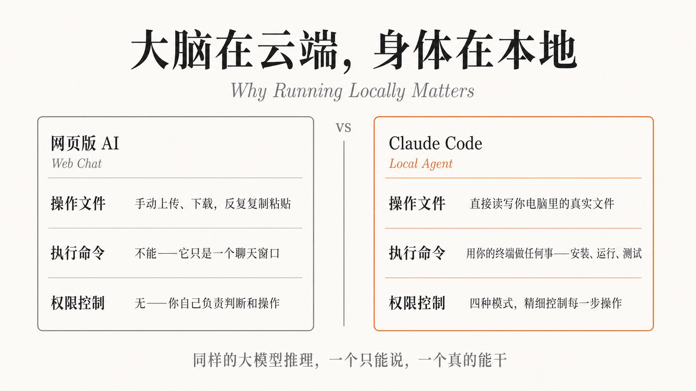

还有一个被很多人忽视的关键区别：Claude Code 是**运行在你的电脑上**的程序，而不是一个网页服务。

这意味着什么？

| | 网页版 AI | Claude Code |
|---|---|---|
| **操作文件** | 你需要手动上传、下载 | 直接读写你电脑里的文件 |
| **执行命令** | 不能 | 可以用你的终端做任何事 |
| **权限控制** | 无（你自己负责） | 四种模式，精细控制 |
| **隐私** | 对话内容上传到云端 | 大脑在云端推理，但身体在本地执行 |

💡「简单来说」：CC 的大脑在云端（调用 API 推理），但身体在你的电脑上（操作真实文件）。这个分工，让它比任何纯网页 AI 产品都强大。

---

## Claude Code 能力三层总结

用一句话帮你记住 Claude Code 的能力边界：

| 层级 | 能做什么 | 比如 |
|------|---------|------|
| 🟢 **基础** | 写代码、解释代码、修 Bug | 「帮我把这段代码加上注释」 |
| 🟡 **进阶** | 读懂整个项目、修改功能、运行测试 | 「在番茄钟里加一个统计页面」 |
| 🔴 **高级** | 自主从零交付完整项目，做你的项目执行 Agent | 「帮我从零做一个 AI 写作助手网站」 |

💡 你现在在哪一层不重要——读完这本书，你至少能达到 🟡 层，练完实战篇就是 🔴 层。

---

## 本章要点

- ✅ Claude Code 是 **AI Agent（智能体）**，不是聊天机器人——它能真正「干活」
- ✅ 核心机制是 **LLM Loop**：大模型思考 → 调用工具 → 执行操作 → 看到结果 → 继续思考，直到任务完成
- ✅ 跟 Copilot、Cursor、Trae 等工具比，CC 的优势在于 **自主完成整个项目**，而不仅是辅助写代码
- ✅ 「同样的模型，不同的身体」——CC 的 **Harness 工程**才是它最核心的竞争力
- ✅ 五种核心场景：Web Coding、一次性复杂任务、自动化、批量处理、自我诊断
- ✅ 它**运行在你的电脑上**，可以直接操作本地文件和终端

---

*下一章我们将了解 Claude Code 的两种使用模式——CLI 命令行 和 Desktop 桌面应用，帮你选出最适合自己的方式。*

---


# 第二章：CLI 还是 Desktop？选择你的使用模式

> **本章定位**：安装之前先做选择。Claude Code 有两种完全不同的使用方式——命令行（CLI）和桌面应用（Desktop）。本章帮你搞清楚两者的区别、各自适合谁、能不能一起用。
>
> **预计阅读时间**：10 分钟

---

### 2.1 两种模式，同一颗大脑

很多人以为「Claude Code Desktop」就是给终端版套了个图形壳——这个理解是错的。

实际上，Claude Code 有两种独立的「身体」：

- **CLI（命令行界面）**：运行在终端里，纯文本交互，通过 `claude` 命令启动
- **Desktop APP（桌面应用）**：独立的 Mac/Windows 应用程序，带完整图形界面

它们共用同一颗「大脑」——背后都是同一个 Claude Code 引擎，调用的都是 Claude 系列模型。但两种身体的构造完全不同，适合的场景也完全不同。

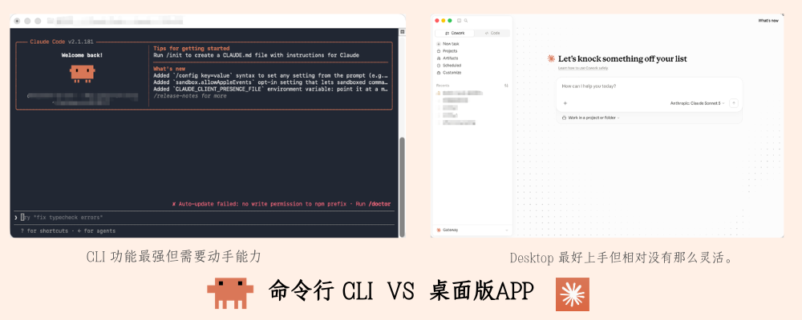

在决定装哪个之前，先看一张总表建立概念：

| 项目            | 🖥️ CLI（命令行）                      | 🖼️ Desktop APP（桌面应用）                     |
| ------------- | --------------------------------- | ----------------------------------------- |
| **界面**        | 终端 TUI / 文本交互                     | GUI：多窗格（chat / diff / terminal / preview） |
| **核心能力**      | 完整能力（文件操作 / git / 工具调用）           | 完整能力（同引擎）                                 |
| **安装方式**      | npm / brew / CLI 安装               | dmg / exe 安装包                             |
| **文件/代码操作**   | 自动读写 repo，可直接运行 shell 命令          | 可视化文件操作 + 内置编辑器                           |
| **图片/PDF/附件** | ✔ 直接拖拽 / 粘贴，但偏「路径/命令式」            | ✔ 直接拖拽 / 粘贴（体验更好）                         |
| **Diff 查看**   | git diff / 文本 diff                | ✔ 可视化逐行 diff（更强）                          |
| **多会话管理**     | 手动 terminal tabs / tmux           | ✔ 自动并行 session + worktree 隔离              |
| **终端能力**      | ✔ 原生 shell / CI / cron / pipeline | ✔ 内置 terminal（但偏交互，不用于 CI）                |
| **自动化脚本**     | ✔ 强（CI/CD / cron / API workflow）  | ❌ 不适合自动化                                  |
| **应用预览**      | 外部浏览器                             | ✔ 内置 preview（HTML/PDF/前端）                 |
| **模型选择**      | CLI 参数 / config                   | UI 下拉选择                                   |
| **配置共享**      | ~/.claude.json / MCP / CLAUDE.md  | ✔ 与 CLI 共享配置                              |
| **权限控制**      | 更细（可用于自动批准等）                      | GUI 模式控制（更安全但更限制）                         |
| **Linux 支持**  | ✔ 支持                              | ❌ 不支持                                     |
| **适合人群**      | 工程化 / 自动化 / 重度开发                  | 交互式开发 / 多任务 / 代码审查                        |

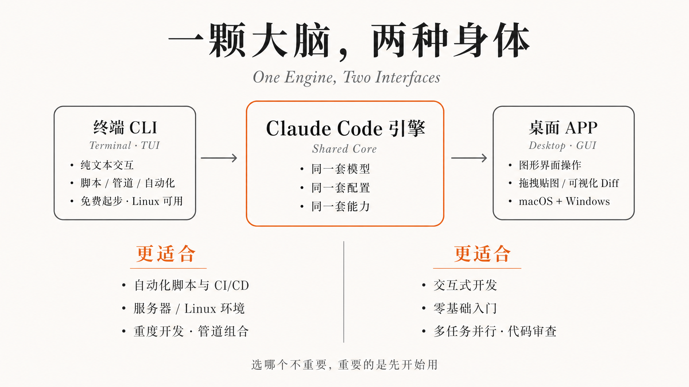

💡「简单来说」：CLI 功能最强但需要动手能力，Desktop 最容易上手但相对没有那么灵活。

---

### 2.2 CLI 模式详解 — 终端里的 AI 工作台

CLI 是 Claude Code 最原生的形态。启动方式就是打开终端，输入：

```bash
claude
```

然后你会看到一个纯文本的对话界面。没有侧边栏、没有文件树、没有按钮——只有文字。但这个看似简陋的界面，是所有模式里**功能最完整的**。

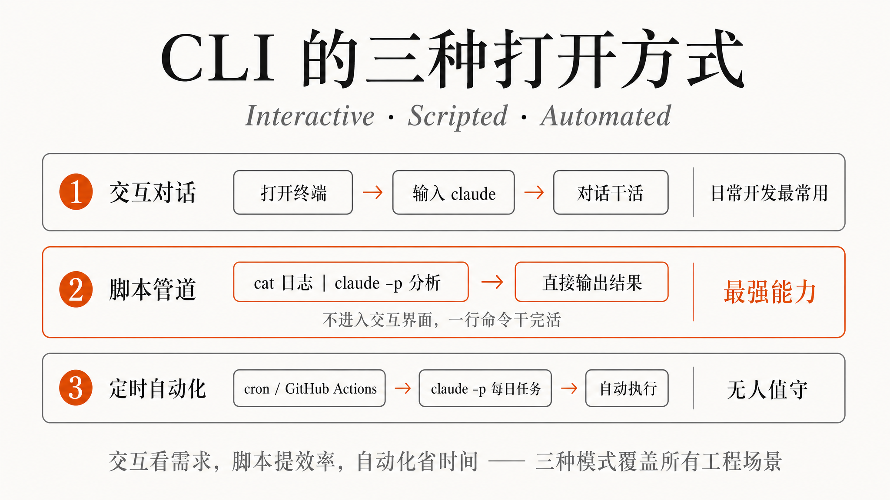

#### CLI 的独特优势

**① 脚本化 — 一行命令干完活**

CLI 最强大的能力不在对话里，而在 `--print`（简称 `-p`）模式。你可以用一行命令让 CC 直接执行任务并输出结果，不需要进入交互界面：

```bash
# 分析日志文件
cat error.log | claude -p "分析这段日志，找出所有 Error 的根因"

# 一键生成 commit message
git diff | claude -p "根据这个 diff 写一句中文 commit message"

# 批量处理文件
ls *.csv | claude -p "读取这些 CSV 文件，合并后生成汇总表"
```

📋「提示词模板」：`claude -p "你对一段文字的任务描述"` — 可以接在任何管道后面。

**② 自动化与 CI/CD**

CLI 可以编入脚本、cron 定时任务、GitHub Actions 流水线。比如：

```bash
# 每天早上 9 点自动跑测试并生成报告
0 9 * * * cd /path/to/project && claude -p "运行所有测试，如果失败发飞书通知"
```

Desktop 不能做这些——它只能你手动打开、手动操作。

**③ 免费起步，Linux 可用**

CLI 免费账户就能用，只是有使用额度限制。而且是唯一支持 Linux 的方式——Desktop 只提供 macOS 和 Windows 版。

#### 模型选择：CLI 和 Desktop 都支持第三方

值得一提的是，**两种模式都可以接入第三方模型**。CLI 配合 CC Switch、Desktop 在设置中配置后在下拉菜单切换——DeepSeek、豆包、智谱 GLM 等国产和免费模型都能用。本书安装章节会详细讲解配置方法。

#### CLI 的局限

- **图片处理不如 Desktop 顺手**：虽然新版 CLI 已支持粘贴图片（macOS: Ctrl+V / Windows: Alt+V），但相比 Desktop 拖拽 + 直接粘贴的体验仍显繁琐
- **纯文本 Diff**：代码改动只能看文字版 + - 对比，没有可视化高亮
- **对新手不够友好**：终端界面容易被误解为「程序员专属」

🔰「新手建议」：终端本质就是一个「跟电脑说话的白板」，不是写代码专用。你只需要会打字和复制粘贴就够了。

---

### 2.3 Desktop 桌面版详解 — 独立 App 体验

Claude Code Desktop 发布于 2025 年下半年，并在 2026 年 4 月经历了一次重大改版。

现在的 Desktop 是一个完整的桌面应用程序，打开它就像打开 VS Code 或任何一款其他软件。

#### 为什么桌面版 APP 对新手更友好

如果你跟我一样，从小到大用的都是「可视化应用」——微信是图标、Word 是图标、浏览器是图标——那么 Desktop 就是你的舒适区。我们这一代人习惯了「看到什么点什么」，不习惯「对着黑窗口打字」。

几个真实场景你就明白差别有多大：

**打开一个项目：**

🖼️ Desktop：点击菜单栏 → 文件 → 打开文件夹 → 在 Finder 里选目标文件夹 → 搞定。
🖥️ CLI：打开终端 → 输入 `cd /Users/你的名字/Documents/项目名` → 路径打错了 → 重来。

**拖一个文件进去让 AI 处理：**

🖼️ Desktop：从 Finder 把 PDF 拖进对话框 → AI 自动读取。
🖥️ CLI：记住文件路径 → 手动输入 `@/Users/你的名字/Downloads/报告.pdf` → 确认路径没错。

你会发现，Desktop 的操作逻辑跟微信发图、Word 拖文件一模一样。零学习成本。

🔰「新手建议」：如果你以前看到「终端」两个字就下意识回避，**先从 Desktop 开始**。等你在 App 里熟悉了 CC 的工作方式，再去学 CLI 就只是换了个界面，不会觉得困难。Desktop 是你理解 Agent 工作方式的最佳过渡。

💡「简单来说」：Desktop 让你把精力花在「想清楚要做什么」上，而不是「怎么操作这个工具」。

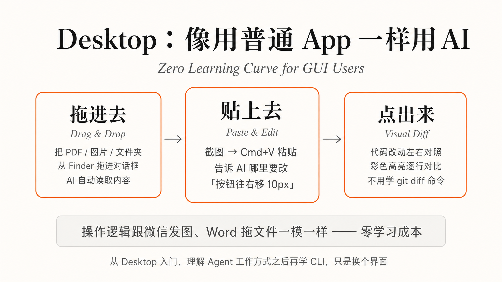

#### Desktop 的局限

- **不能自动化**：Desktop 是**交互式 GUI 工具，不支持 CLI 的 headless/脚本模式（如 `-p`）**
- **仅支持 macOS 和 Windows**：Linux 用户只能用 CLI

---

### 2.4 可以同时用吗？当然可以

短答：**完全可以**，而且推荐两个都装。装了 Desktop 之后 CLI 不用卸载——两者可以在同一个项目上并排工作。

先澄清一件容易混淆的事：**Claude Desktop 应用里其实有三个 tab**：

- **Chat** — 普通对话（就像你用 claude.ai）
- **Cowork** — Agent 模式，处理长任务
- **Code** — 这就是「Claude Code Desktop」的完整界面

本节说的「Desktop 与 CLI 共享」，指的是 **Code tab 与 CLI 之间的关系**。

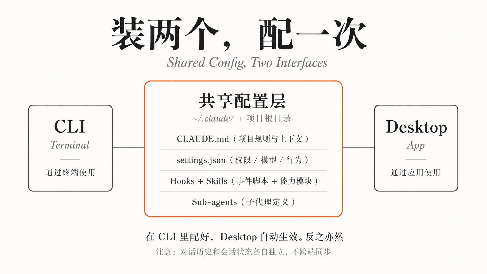

### 共享的机制：读同一份文件

「共享」不是两个软件在互相同步，而是**两端都从相同的路径读取配置文件**。所以你在 CLI 装的 Skill、写的 `CLAUDE.md`，Desktop 一打开就直接生效，反过来也一样。

用官方文档的话：

> Desktop and CLI read the same configuration files, so your setup carries over.

### 真正共享的清单

| 类别               | 存放位置                                                   |
| ---------------- | ------------------------------------------------------ |
| 项目上下文            | `<项目>/CLAUDE.md`、`CLAUDE.local.md`                     |
| 项目级配置 / 权限       | `<项目>/.claude/settings.json`                           |
| 项目级 MCP          | `<项目>/.mcp.json`                                       |
| 用户级设置            | `~/.claude/settings.json`                              |
| 用户级 MCP          | `~/.claude.json`（的 `mcpServers` 段）                     |
| Skills           | `~/.claude/skills/`、`<项目>/.claude/skills/`             |
| Sub-agents（子代理） | `~/.claude/agents/`、`<项目>/.claude/agents/`             |
| Hooks            | 在 `settings.json` 里定义                                  |
| 插件               | `~/.claude/plugins/`                                   |

规律很简单：**所有 Claude Code 相关的能力扩展都在 `~/.claude/` 或项目内 `.claude/`，两端物理路径完全一致，装一次两边都能用。**

### 一个容易踩坑的例外

Desktop 应用还维护着一份**独立的 MCP 配置文件**：

```
~/Library/Application Support/Claude/claude_desktop_config.json
```

这份配置 Desktop 应用（Chat + Cowork + Code 三个 tab）都能读，**但 CLI 读不到**（CLI 只看 `~/.claude.json`）。所以如果你在 Desktop 的图形界面里点鼠标装了一个 MCP，想让 CLI 也用上，需要执行一次导入命令：

```bash
claude mcp add-from-claude-desktop
```

这条命令会把 `claude_desktop_config.json` 里的 MCP 服务器复制到 `~/.claude.json`，之后 CLI 就能看到了。

### 明确不共享的（官方原话）

> Each maintains separate session history.

具体来说：

- **会话历史**：CLI 的 `~/.claude/history.jsonl` 和 Desktop 的 session 数据各存各的，不会互相看到
- **当前进行中的任务与临时状态**：切换客户端等于从零开始一个新会话
- **窗口布局、pane 位置、UI 偏好**：Desktop 独有，与 CLI 无关

### 一个实用小技巧：把 CLI 会话一键搬到 Desktop

如果你正在 CLI 里跑一个任务，突然想改用图形界面看 diff、拖文件，直接在 CLI 里输入：

```bash
/desktop
```

当前 session 会自动保存并在 Desktop 里打开，CLI 自己退出。反过来 Desktop 没有对应的一键命令，但因为项目级配置本来就共享，重新在 CLI 里 `cd` 到同一个项目路径就能继续工作。

⚠️「注意」：**装两个、配一次，但对话记忆不会跨端接续。** 如果需要在两端之间传递对话产出，用 `CLAUDE.md`、Skills 或直接把结论写入项目文件——这样下次不管在哪端打开，都能读到。

---

### 本章要点

- ✅ Claude Code 有两种模式：**CLI（命令行）** 和 **Desktop（桌面应用）**，共用同一引擎
- ✅ CLI 自动化最强：脚本化、管道、CI/CD、Linux，免费可用
- ✅ Desktop 体验最好：可视化 Diff、并行会话、拖拽贴图、集成预览
- ✅ 第三方模型：CLI 和 Desktop 都支持 CC Switch 接入国产/免费模型
- ✅ 零基础用户推荐路径：先 Desktop 入门 → 后 CLI 进阶
- ✅ 两者可以同时安装，**配置自动共享**

---

*下一章我们将正式开始安装 Claude Code。无论你选 CLI 还是 Desktop，我都会一步步带你走完。*

---

# 第三章：快速安装与配置

# 快速安装与配置

> **本章定位**：动手章节。不管你是 Mac 还是 Windows，CLI 还是 Desktop，本章带你一步步把 Claude Code 装好、配好、跑通第一次对话。
>
> **预计阅读时间**：15 分钟

---

## 3.1 安装四步走（心里有数）

别被「安装」两个字吓到。整个过程跟装一款新游戏差不多——装运行库 → 装游戏 → 注册账号 → 开玩。

Claude Code 的安装也是四步：

| 步骤  | 做什么                                     |
| --- | --------------------------------------- |
| ①   | **装配套工具**（Git 版本控制 / VS Code 编辑器，都可选）  |
| ②   | **装 Claude Code 本体**（CLI 或 Desktop）     |
| ③   | **搞定付费**（Claude 订阅 或 第三方 API Key）       |
| ④   | **配 Key 连上模型**                          |

💡「简单来说」：① 是可选的准备工作。② 跟装普通软件一样。③ 和 ④ 就是「哪里付钱、哪里填密码」，不用怕。

🔰「新手建议」：如果你读到「Node.js」「环境变量」这种词开始紧张——别怕，这章就是帮你一步步搞定的。**你不需要理解它们是什么，照做就行。**

---

## 3.2 前置准备（CLI 和 Desktop 通用）

不管你选 CLI 还是 Desktop，以下三样东西都是**可选的**（装了体验更好，但都不影响 CC 本体安装）。你可以先直接跳到 3.3 装 CC，回头再回来补这些。

### ⓪ 如何调出终端（新人必读）

如果你以前从没打开过「终端」这个东西，这一小节就是为你准备的。

**macOS：**

打开终端有三种方式：

- 🖼️ 在「启动台」里找到「终端」图标，点击打开
- 🖼️ 按 `Cmd + 空格` 打开 Spotlight，输入「Terminal」或「终端」，回车
- 🖼️ 打开 Finder → 应用程序 → 实用工具 → 终端

打开后你会看到一个白底黑字或黑底白字的窗口，上面有一行类似 `用户名@MacBook ~ %` 的文字，后面有个闪烁的光标——这就是你可以输入命令的地方。

**Windows：**

- 🖼️ 按 `Win` 键，输入「PowerShell」或「终端」，回车
- 🖼️ 右键点击开始菜单 → 选择「Windows PowerShell」或「终端」

打开后你会看到一个蓝底或黑底的窗口，上面写着 `PS C:\Users\你的用户名>` —— 这就是你可以输入命令的地方。

💡「简单来说」：终端就是一个「跟电脑打字说话」的窗口。不用怕它——你只需要把教程里的命令复制粘贴进去，按回车就行。

🔰「新手建议」：第一次打开终端可能会觉得「这东西好可怕」。没关系，把它当成一个只能用键盘操作的聊天窗口。你不会弄坏电脑的——装个软件而已。

### ① Git — 你的「存档系统」（推荐）

Git 是版本控制工具。简单理解就是：它帮你记住每一次文件改动的快照，哪天改错了能一键回滚。

Claude Code 会自动帮你用 Git，你不需要会 Git。但电脑上需要装一个。

- 🖼️ macOS：去 [git-scm.com](https://git-scm.com) 下载安装包，或 `brew install git`
- 🖼️ Windows：同样去官网下载，下载完安装包后一路点击下一步
- 验证：终端输入 `git --version`

Windows 用户前往官网下载过程如图所示：

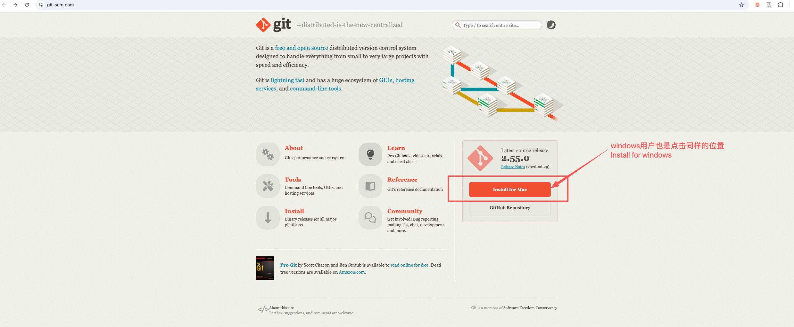

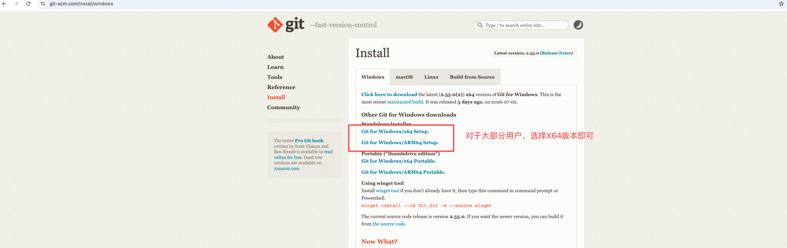

🔰「新手建议」：把 Git 当成游戏里的「存档 / 读档」功能。不需要学，让它安静待在后台就行。

### ② VS Code（代码相关任务推荐）

VS Code 是微软出的免费编辑器。Claude Code 不强制需要它，但它自带文件树 + 终端 + 编辑器，跟 CC 配合体验最好。

🖼️ 去 [code.visualstudio.com](https://code.visualstudio.com) 下载安装即可。

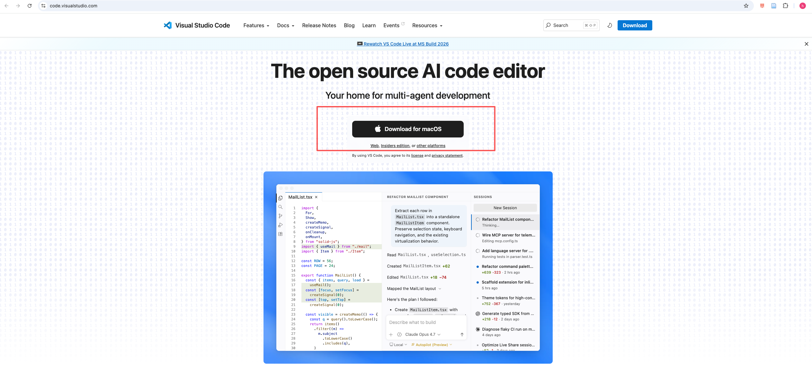

### ③ Node.js — 只在你走 npm 安装时才需要（多数人可跳过）

⚠️「注意」：**这一节多数人可以跳过。** 3.3 节推荐的官方原生安装脚本（PowerShell / curl 一键装）**不依赖 Node.js**——CC 下载下来是一个自包含的原生二进制，自带运行时。

只有以下两种情况才需要装 Node.js（要求 **v22 或更高**）：

1. 你偏好用 `npm install -g @anthropic-ai/claude-code` 这种方式安装
2. 你需要给 Claude Code 写 MCP 服务器 / hook 脚本，且用 Node.js 编写

**如果确实需要装：**

🖼️ 打开 [nodejs.org](https://nodejs.org) → 下载 LTS 安装包 → 一路点「下一步」→ 装完。

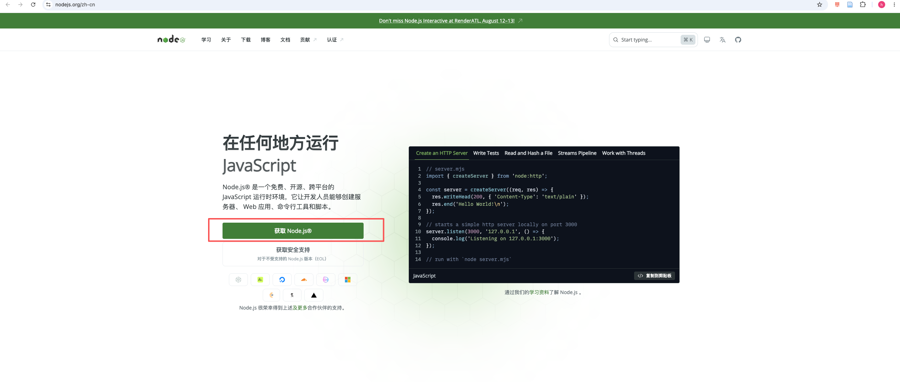

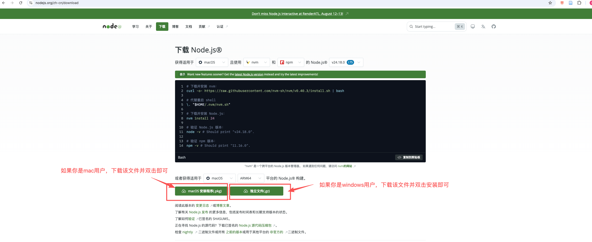

🖥️ 或者用命令行（macOS 用户推荐）：

```bash
# macOS — 用 Homebrew（如果没有 brew，先去 brew.sh 装一个）
brew install node

# 验证装好了没
node --version
# 应该输出类似 v22.x.x
```

🔰「新手建议」：不确定要不要装？先跳过。3.3 节的官方脚本对绝大多数读者已经够用。

---

## 3.3 CLI 安装

好，前置准备做完了。现在装 Claude Code 本体。

### macOS

**推荐：官方一键安装脚本**

打开终端（Terminal），粘贴回车：

```bash
curl -fsSL https://claude.ai/install.sh | bash
```

跟 Windows 一样，脚本会自动下载 macOS 原生的 `claude` 二进制到你的用户目录（`~/.local/bin/claude`），并配好 PATH。**不依赖 Node.js**。

**其他安装方式**（任选一种即可，效果一样）：

```bash
# Homebrew（跟着稳定通道更新，慢一周）
brew install --cask claude-code

# npm（需要预装 Node.js 22+）
npm install -g @anthropic-ai/claude-code
```

装完**关掉当前终端窗口，重新开一个**，然后验证：

```bash
claude --version
```

看到版本号（形如 `2.1.xxx`）就装好了。

🔰「新手建议」：不确定选哪种？就用第一种官方脚本。它是 Anthropic 官方推荐的方式，装好后会自动在后台更新，多数人不用再操心。

### Windows

**Windows 现在支持原生安装，不再需要 WSL。** 网上很多老教程还在教「先装 Ubuntu 再装 CC」——那是 2025 年初的做法，现在可以直接忽略。

**推荐：PowerShell 一键安装**

打开 PowerShell（**不需要**管理员权限），粘贴下面这行回车：

```powershell
irm https://claude.ai/install.ps1 | iex
```

脚本会自动下载 Windows 原生的 `claude.exe` 到你的用户目录，并配好 PATH。

**其他安装方式**（任选一种即可，效果一样）：

```powershell
# WinGet（Windows 11 内置的包管理器）
winget install Anthropic.ClaudeCode
```

```batch
:: CMD 用户
curl -fsSL https://claude.ai/install.cmd -o install.cmd && install.cmd && del install.cmd
```

**装完关键一步**：**关掉当前终端窗口，重新打开一个**。不重开的话 `claude` 命令会提示 `not recognized`——这不是安装失败，是新配置的 PATH 还没在旧窗口里生效。

在新开的终端里验证：

```powershell
claude --version
```

看到版本号（形如 `2.1.xxx`）就装好了。

💡「简单来说」：不用 WSL、也不用 Node.js（Windows 原生安装脚本自己带运行时，3.2 节的 Node.js 是给 macOS/Linux 走 npm 安装方式的读者用的）。整个过程 = 一行 PowerShell + 重开终端。

🔰「新手建议」：分不清自己开的是 PowerShell 还是 CMD？看提示符——`PS C:\` 开头是 PowerShell，`C:\` 开头是 CMD。命令别搞混了，Windows 用户装 CC 出错的第一常见原因就是这个。

⚠️「注意」：如果 3.2 节你已经装了 [Git for Windows](https://git-scm.com/downloads/win)，Claude Code 会自动用它来跑 Bash 命令（体验更接近 macOS）。没装也没关系，CC 会自动回落到 PowerShell，一样能用。

### 第一次启动

**注意，由于相当一部分用户使用的是第三方 API，因此建议使用第三方 API 的用户直接跳转到 [3.5 特别篇：中国用户配置第三方模型](#35-特别篇中国用户配置第三方模型)。**

装好后，在终端输入：

```bash
claude
```

首次启动会引导你登录 Claude 账号（或输入 API Key）。按提示操作即可。

⚠️「注意」：终端报错了别慌。把报错截图发给任意 AI（ChatGPT / 豆包 / Claude 网页版），它都能告诉你哪出了问题、怎么修。这些报错对 AI 来说一眼就能看懂。

---

## 3.4 Desktop 安装

Desktop 的安装跟普通软件一模一样，不需要碰任何命令行。

🖼️ **macOS**：
1. 打开 [claude.ai/download](https://claude.ai/download)
2. 下载 `.dmg` 安装包
3. 双击 → 把 Claude 图标拖进 Applications 文件夹
4. 打开 Claude → 登录 Claude 账号
5. 点击顶部 Tab 栏的 **Code** → 进入 Claude Code Desktop

🖼️ **Windows**：
1. 同样去 [claude.ai/download](https://claude.ai/download) 下载 `.exe`
2. 双击安装 → 一路下一步
3. 登录 → Code Tab

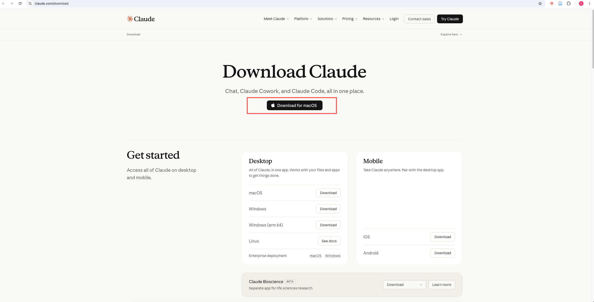
💡「简单来说」：跟你装微信、装 QQ 的操作一模一样。下载 → 双击 → 登录 → 完事。

⚠️「注意」：Desktop 目前只支持 macOS 和 Windows，Linux 用户只能用 CLI。

---

## 3.5 特别篇：中国用户配置第三方模型

这是本章最重要的部分。如果你满足以下任一条件，请仔细读：

- 没有外币信用卡，不想付 $20/月
- 想用国产模型（DeepSeek、豆包、智谱 GLM 等）
- 想先用免费模型体验，再决定是否付费

### 什么是 CC Switch？

CC Switch 是一个开源模型路由器，让你在 Claude Code 里用任何模型——Claude、DeepSeek、豆包、智谱，甚至本地部署的模型都可以。

### 安装 CC Switch

进入官方的github仓库中： https://github.com/farion1231/cc-switch/releases

往下翻，找到最新的发布版本，双击下载后，再双击安装，一路确定即可：

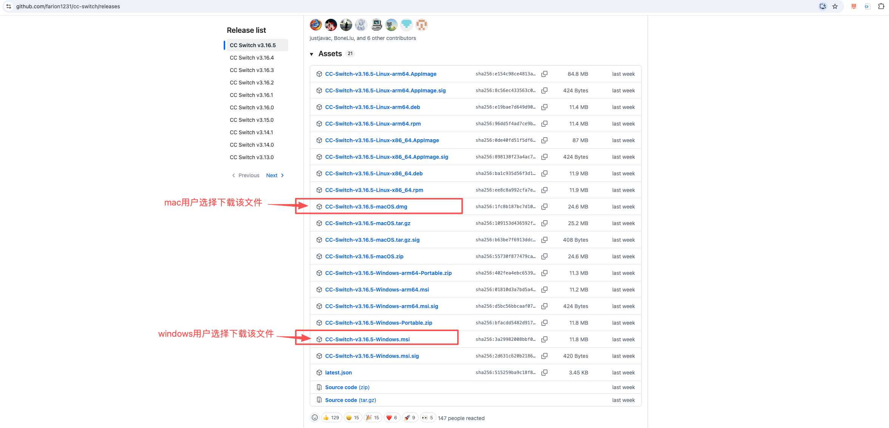


⚠️「注意」：第三方模型的功能可能不完全等同于 Claude 原版（比如某些高级 tool 不支持），但对日常使用影响不大。书的后面章节会标注哪些功能是 Claude 专属的。

### CLI 配置第三方API（以DeepSeek V4为例）

打开CC Switch，你会看到这样的页面：

其中，最上方一栏的左侧标签页，是Claude Code 的 CLI 的标签页，最上方左起第二个标签页是Claude Code Desktop 的配置页面。下面的每一个栏目都是官方 / 第三方API配置选项
。当你第一次打开CC Switch时，只有官方的配置卡片，需要自己新建配置。

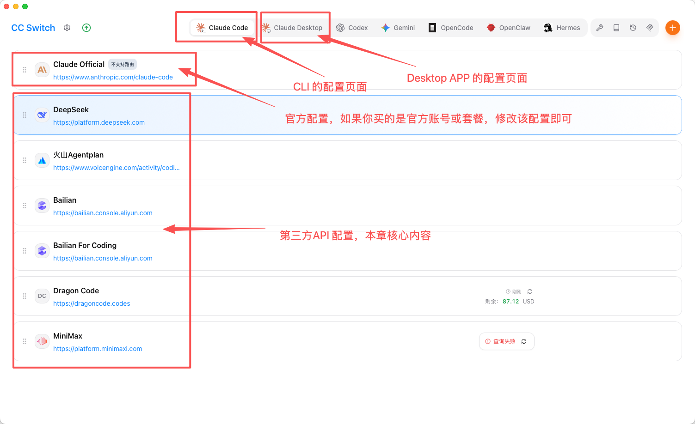
我们以DeepSeek V4 来作为案例，配置我们的第三方API。

首先进入Deepseek API 官网平台： https://platform.deepseek.com/

1. 首先点击左侧边栏的「API Keys」
2. 点击「创建 API Key 按钮」
3. 妥善保存自己的API Key，**DeepSeek 的 API Key 只在生成时显示，后续无法找回！**

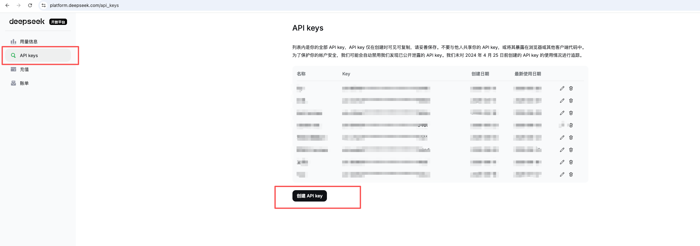

之后回到 CC Switch，完成后续的配置。记得在配置完成后 **点击「添加」按钮**：

1. 点击橙色的「➕」按钮
2. 选择DeepSeek
3. 填写API Key
4. 往下翻，选择模型映射，**点击「一键设置」**
5. **点击右下角「添加」按钮**


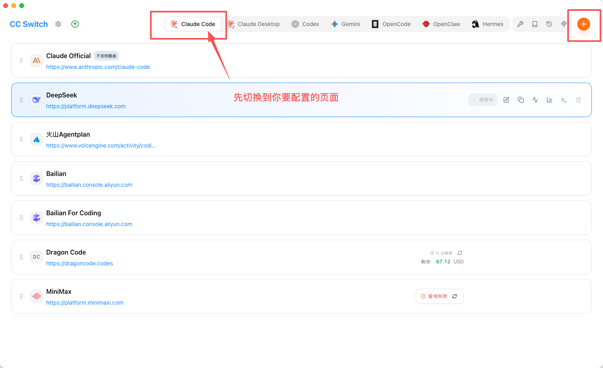

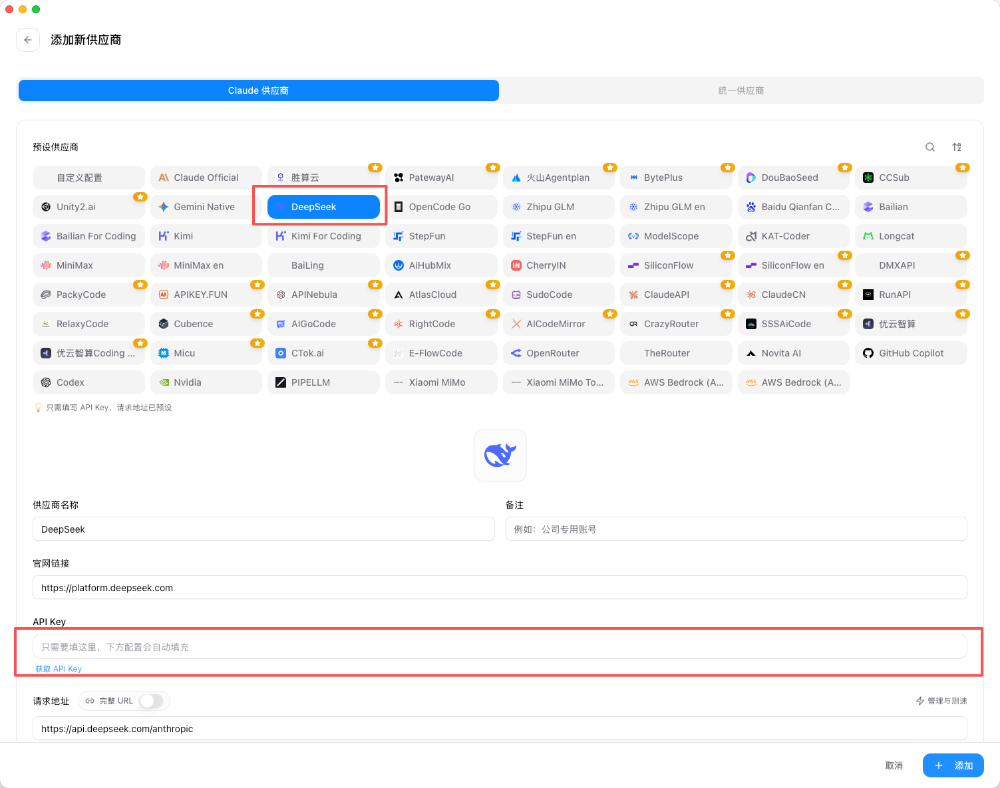

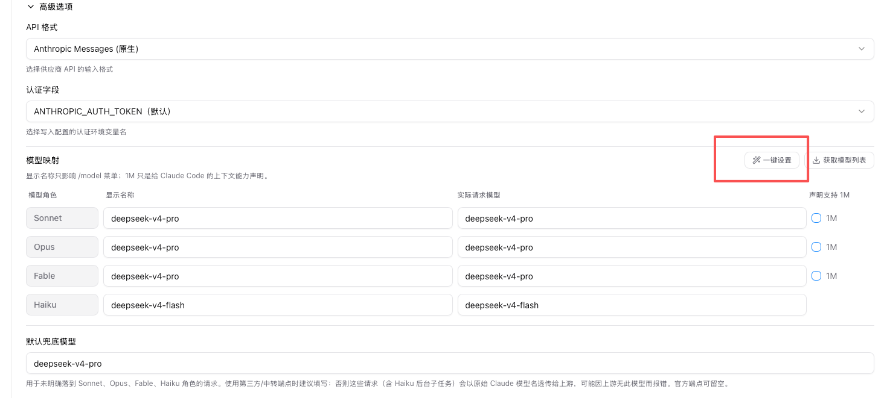

### Desktop 配置第三方API

前面所有步骤与 CLI 配置相同，关键在于最后的步骤，配置模型映射时，需要打开模型映射：

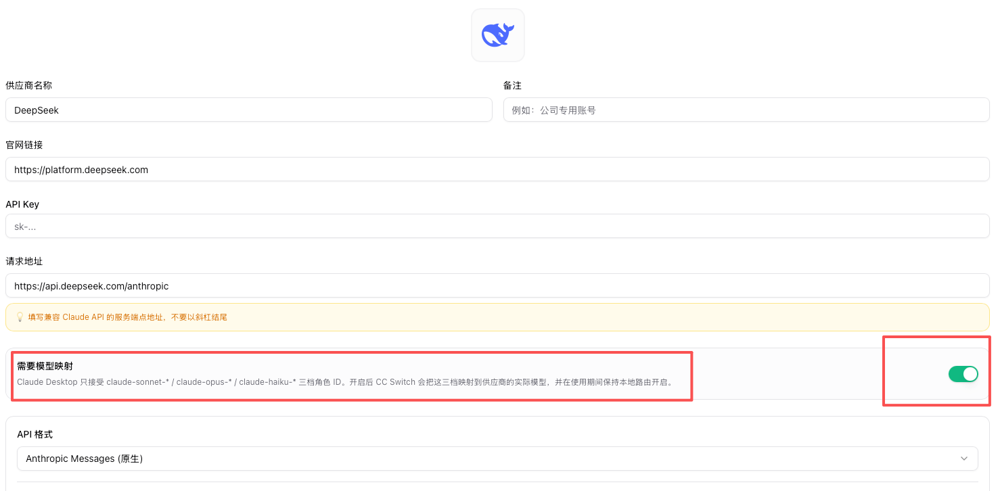

在保存且添加完毕后，**记得一定要开启本地路由！否则配置无法生效：**

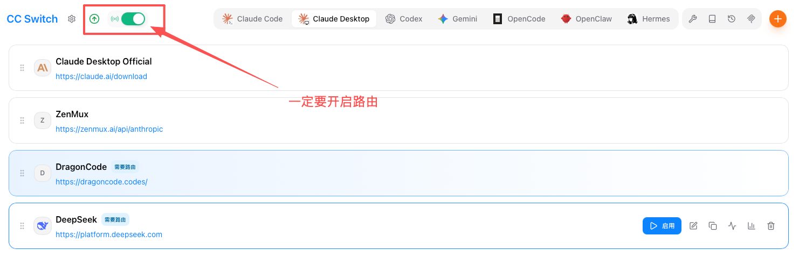

---

## 3.6 Desktop 特别篇：Claude 订阅与额度

Desktop 默认绑定 Claude 官方订阅，不需要额外配置第三方模型（**当然 Desktop 同样支持 CC Switch，配置方式参考 3.5 节）。**

### 套餐对比

| 套餐 | 月费 | 适用人群 |
|------|------|---------|
| **Free** | 免费 | 轻度体验，额度有限 |
| **Pro** | $20/月 | 个人日常使用，最推荐 |
| **Max** | $100/月 | 重度用户 / 开发团队 |
| **Team** | 按人数 | 企业团队，集中管理 |

### Token 额度怎么看

Claude Code Desktop 界面顶部状态栏会显示当前用量。大致参考：

- Pro 用户每个月可以处理几百次中等复杂度任务
- Free 用户额度有限，建议只做轻量对话测试

🔰「新手建议」：先用 Free 体验。如果一周用了 5 次以上，还觉得好用，再升 Pro。

---

## 3.7 验证安装

不管装的 CLI 还是 Desktop，来跑一次对话确认一切正常。

🖥️ **CLI**：打开终端，输入：

```bash
claude -p "你好，用一句话介绍你自己"
```

如果返回了一段 Claude 的自我介绍 → ✅ 安装成功。

🖼️ **Desktop**：打开 Claude → 点 Code tab → 输入框里打「你好」→ 回车。

如果回复了 → ✅ 安装成功。

⚠️「注意」：如果没成功，最常见的三个问题：

1. **`claude: command not found`** → 按你的安装方式对号入座：
   - 走 PowerShell / curl 官方脚本：**关掉终端重开一个**（PATH 需要重新加载），仍然不行就检查 `~/.local/bin`（macOS/Linux）或 `%USERPROFILE%\.local\bin`（Windows）是否在 PATH 里
   - 走 npm：Node.js 没装或 npm 全局路径没配好，回到 3.2 ③ 检查 Node.js
   - 走 Homebrew：`brew doctor` 排查
2. **API Key 无效** → 第三方 Key 打错了或没充值，回到 3.5 确认 Key 正确
3. **网络超时** → 国内访问海外 API 可能被墙，需要开代理或换国内模型

---

## 本章要点

- ✅ 安装 = 四步走：配套工具（可选）→ CC 本体 → 付费 → Key
- ✅ 前置准备都是可选的：Git（存档系统）、VS Code（编辑器）、Node.js（仅 npm 安装方式需要）
- ✅ CLI：官方原生安装脚本一行命令搞定（不依赖 Node.js），`claude` 启动，支持第三方模型
- ✅ Desktop：下载安装包 → 登录 → Code Tab，跟装普通软件一样
- ✅ 中国用户省钱方案：CC Switch + DeepSeek / 智谱，¥10 块钱用很久
- ✅ 装完验证：`claude -p "你好"` 或 Desktop 发一条消息

---

*下一章我们将认识 Claude Code 的界面和基本操作。你已经装好它了，现在来学会怎么用它。*
