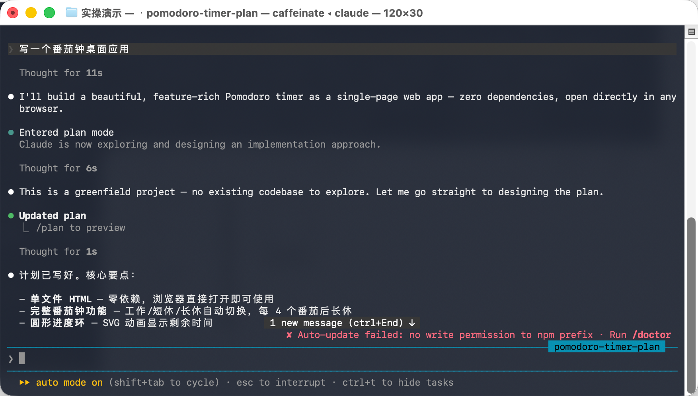
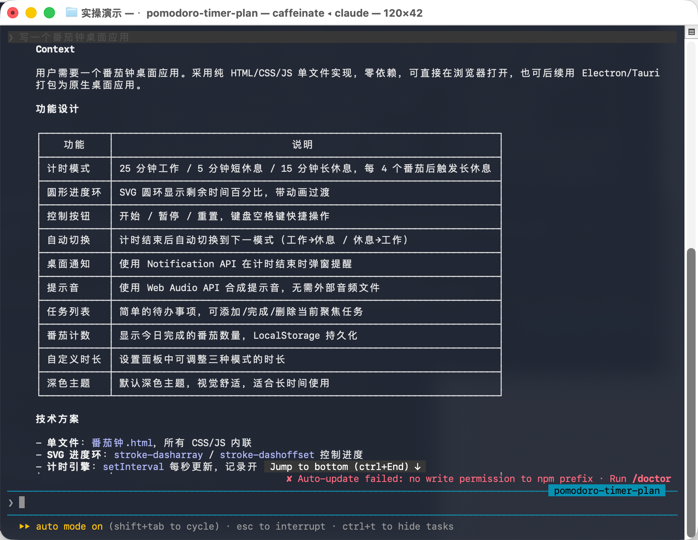
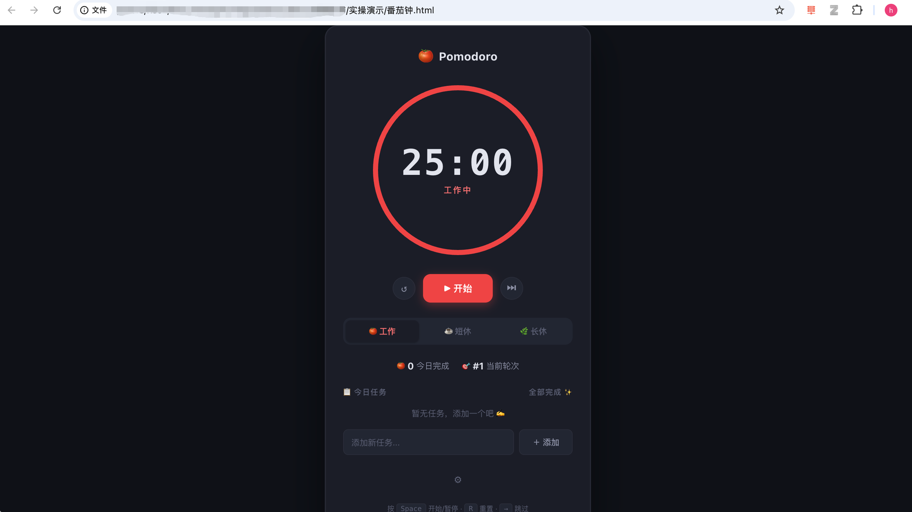
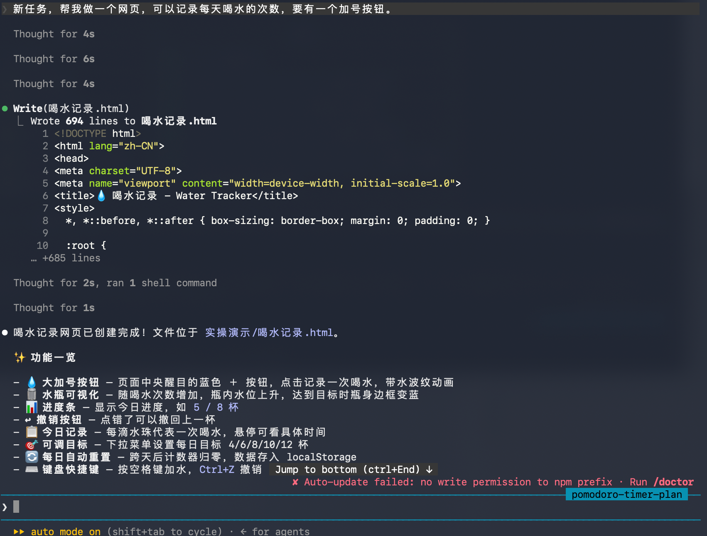
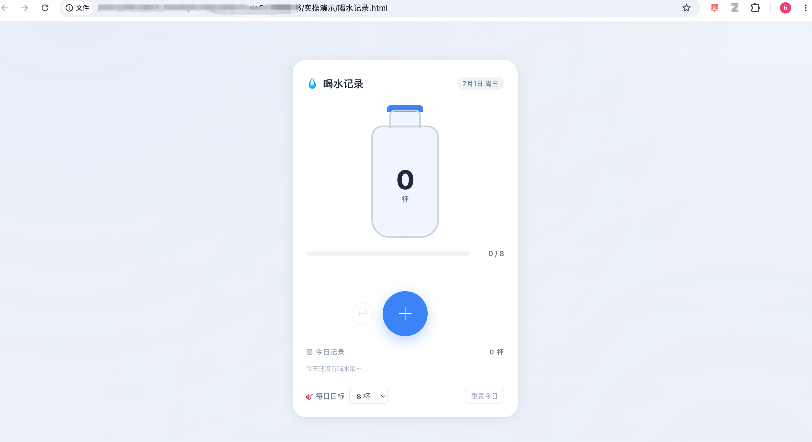
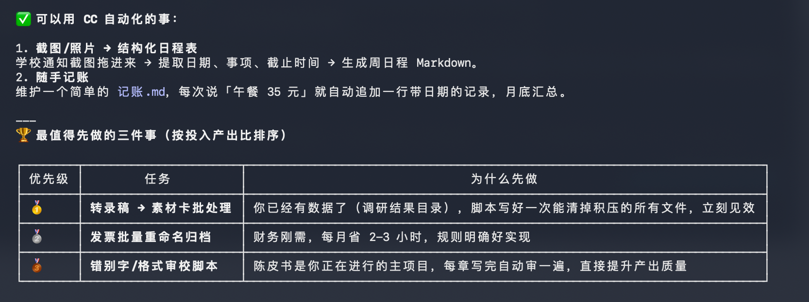

# 从聊天机器人到 AI 智能体

> **本章定位**：基础启蒙第一课。不讲操作、不装软件，先搞懂 Claude Code 到底是什么、为什么厉害、能帮你做什么。读完这章，你会对 CC 有一个完整的心智模型。
>
> **预计阅读时间**：15 分钟

---

## 1.1 你熟悉的 AI vs Claude Code

> 💡 **一句话定位**：Claude Code 不是代码补全工具，也不是 AI 聊天机器人——它是一个**运行在终端里的项目级 AI 工程助手**。它能读懂你整个项目、自己做计划、动手改代码、执行命令、检查结果，直到把活干完。

2022 年底，ChatGPT 横空出世。三年多过去了，我们每个人对这种 AI 的用法都很熟悉了——你问一句，它答一句。你觉得答得不好，换个问法再问一次。

这种「一问一答」的模式，帮你查资料、写文案、翻译文字都没问题。但遇到真正需要「干活」的事情，它就无能为力了。

### 番茄钟的故事

我们来想象一个场景：你想让 AI 帮你做一个桌面番茄钟应用。

**如果是用 ChatGPT（或者其他聊天式 AI）：**

> 👤 你：「帮我写一个番茄钟。」
>
> 🤖 ChatGPT：「好的，这是 HTML/CSS/JS 代码：」← 贴出一大段代码
>
> 👤 你：复制代码 → 新建文件 → 粘贴 → 保存 → 用浏览器打开 → 发现样式不太对 → 回到 ChatGPT
>
> 👤 你：「颜色不太好看，改成简约风格。」
>
> 🤖 ChatGPT：「好的，修改后的代码：」← 又贴出一段
>
> 👤 你：再次复制粘贴 → 刷新浏览器 → 发现按钮位置偏了 → 又回去问……


整个过程，**你**才是那个「干活」的人——AI 只负责给建议，你负责把建议变成现实。AI 就像一个只会说话的军师，没有手脚，不能帮你做事。

**用 Claude Code 做同样的事：**

> 👤 你：「帮我做一个桌面番茄钟应用。」
>
> 🤖 Claude Code：自己思考 → 自己创建文件 → 自己写代码 → 自己安装依赖 → 自己运行测试 → **番茄钟窗口弹出来了。**







你从头到尾只说了一句话。它把活干完了。

这就是 **AI 聊天机器人** 和 **AI 智能体（Agent）** 的本质区别。

💡「简单来说」：聊天 AI = 只动嘴的军师，Agent = 能自己动手干活的助手。

---

## 1.2 Agent 的秘密：大模型循环

Claude Code 为什么能做到「自己干活」？我们来拆解它的核心机制。

### 大脑 + 手脚 = Agent

要理解 Claude Code，你先认识三个角色：

| 角色 | 是什么 | 能干嘛 | 举例 |
|------|--------|--------|------|
| **大模型（LLM）** | AI 的大脑 + 眼睛 | 理解你的需求、观察环境、做出决策 | "我应该先创建一个 HTML 文件" |
| **工具（Tools）** | AI 的手脚 | 读写文件、搜索网络、执行命令、调用服务 | 真的在你的电脑上创建一个文件 |
| **Agent 程序** | 连接大脑和手脚的神经系统 | 把大模型的决策翻译成工具调用，再把结果反馈给大模型 | Claude Code 本身 |

🔰「新手建议」：你不用记住所有工具的名字——现在只需要理解这个「大脑指挥手脚干活」的比喻就够了。

### LLM Loop：AI 的工作循环

普通聊天 AI 是这样工作的：

```
你提问 → AI 回答 → 结束
```

Claude Code 是这样工作的：


这个过程就叫 **LLM Loop（大模型循环）**。它让 AI 从「一问一答」变成了「持续干活」。

### 为什么 Claude Code 特别聪明？

市面上有很多 Agent 产品，但 Claude Code 的循环设计得特别出色。用一个比喻：

- 🪆 **普通 Agent** = 实习生。你推他一步，他走一步。推得不明确，他就停了。
- 🧠 **Claude Code** = 成熟的职场人。你给他一个目标，他自己规划步骤、调用工具、执行操作、检查结果。卡住了？他会自己上网搜索找解决方案。遇到报错？他会自己 Debug。


这就是「自主决策循环」：**感知环境 → 推理决策 → 调用工具 → 评估结果 → 继续循环**。整个过程你只需要在开始说一句话，中间最多点几次「同意」。

---

## 1.3 Claude Code 和别的工具有什么不同

市面上 AI 编程工具不少，我们来对比一下，帮你快速建立坐标系。
### Claude Code 与 Copilot 的区别

很多人会问：既然 Copilot 也能帮我写代码，为什么还要用 Claude Code？

核心区别在于：Copilot 更像一个**贴身助理**——你写代码时它在旁边看着，猜你接下来要写什么，帮你补全。但 Claude Code 更像一个**外包团队**——你把整个需求丢给它，它自己规划、写代码、跑测试、修 Bug，最后交给你一个能用的东西。

Copilot 适合帮你**写得快**。Claude Code 适合帮你**做完事**。

更合理的用法是：日常编码用 Copilot 提效，复杂项目或从零开发时用 Claude Code 完整交付。


---

### Claude Code 与 Cursor 的区别

很多人会问：Cursor 不也能在编辑器里跟 AI 对话改代码吗，CC 有什么不同？

核心区别在于：Cursor 更像一个**会 AI 的编辑器**——你在编辑器里写代码，AI 帮你改、帮你补、帮你解释。但 Claude Code 更像一个**会用编辑器的 AI**——它不依赖你手动打开文件、选中代码，你只需要说目标，它自己决定要改哪些文件、执行什么命令。

Cursor 适合**你在写代码时辅助你**。Claude Code 适合**你不用写代码时替代你**。

更合理的用法是：用 Cursor 做轻量编辑和代码审查，用 Claude Code 做重度开发和完整项目交付。


---

### Claude Code 与 Codex 的区别

很多人会问：Codex 也是命令行 Agent，也能自主干活，和 CC 有什么不同？

核心区别在于：Codex 更像 OpenAI 生态里的**工程助手**——它背后是 GPT 系列模型，深度绑定 OpenAI 的工具链。而 Claude Code 更像 Anthropic 生态里的**长期工程伙伴**——它不仅有 Claude 模型驱动，还有更成熟的 Harness 设计、更丰富的 Skills/Hooks/Plugins 生态，以及更灵活的模型接入（支持第三方）。

Codex 适合**已经在 OpenAI 生态中的开发者**。Claude Code 适合**想要最成熟 Agent 体验、不想被单一模型绑定的用户**。

更合理的用法是：如果你已经深度使用 OpenAI 全家桶，Codex 是不错的延伸；如果你想体验当前最强的 Agent 驾驭系统，Claude Code 是更好的选择。


---

💡「简单来说」：Copilot 帮你写一段代码，Cursor 帮你改一个文件，Claude Code 帮你做完整个项目。

🔰「新手建议」：不用纠结「我该用哪个」——这本书就是教你用好 Claude Code 的。掌握它之后，其他工具你也能很快上手。

| 工具 | 一句话概括 | 收费 | 强项 | 弱项 |
|------|-----------|------|------|------|
| **GitHub Copilot** | 代码自动补全插件 | 付费 | 在你写代码时智能预测下一行 | 只能补全，不能自主干活 |
| **Cursor** | AI 增强版 VS Code | 付费 | 在编辑器内对话 + 改代码，体验流畅 | 付费额度有限制 |
| **Trae** | 字节跳动的 AI 编辑器 | 国内免费 | 中文理解好，零基础友好 | 偏门技术栈准确性一般 |
| **Codex / OpenAI CLI** | OpenAI 的命令行 Agent | 付 API 费 | 背后是 GPT 系列模型 | 使用门槛较高 |
| **Windsurf** | 另一个 AI IDE | 付费 | 类似 Cursor | 生态不如前几个成熟 |
| **Claude Code** | Anthropic 的终端 Agent | 订阅或 API | 自主干活能力最强，harness 最好 | 终端界面，小白上手需要适应 |

---

## 1.4 为什么是「Harness 的集大成者」

你可能听过一个词——**Harness（驾驭系统）**。

用大白话解释：Harness 就是 Agent 这个「身体」的设计水平。同样的大脑（大模型），装在不同的身体里，表现天差地别。

举个例子：同样是调用 Claude Sonnet 模型：

- 你在 **Claude 网页版**里问它 → 它只能给你文字建议
- 你通过 **Claude Code** 调用同一个模型 → 它能读你的整个项目、修改文件、运行命令、测试结果

一样的脑子，不一样的身体，能干的事完全不一样。

Claude Code 的 Harness 设计好在哪？几个关键点：

- 🔄 **自主循环**：不是推一步走一步，而是自己持续推进直到任务完成
- 📂 **终端原生**：直接运行在你的电脑上，不受浏览器沙箱限制
- 🧠 **超长上下文**：能记住整个项目的来龙去脉，不会做着做着「失忆」
- 🛡️ **权限清晰**：什么操作要问你、什么可以直接做，边界分明
- 🧩 **官方 Skill**：Anthropic 团队提前设计了大量开箱即用的技能包

🔰「新手建议」：不用深究 Harness 这个词。你只需要知道——Claude Code 不只是给大模型套了个壳，它的「身体」经过精心设计，这才是它真正厉害的地方。

---

## 1.5 Claude Code 能做什么


知道了 Claude Code 的原理，你可能会想：它具体能帮我干什么？

使用 Claude Code 的人大致分三类，每一类用它做完全不同的事。

### **第一类：完全不会编程的人**

这群人用 CC，不是为了写代码，是为了**省掉重复劳动**。对他们来说，CC 就是一个「能操作电脑的 AI」。

他们用它做的事包括：整理文件夹（批量重命名、分类归档、删除重复文件）、处理表格（合并 Excel、筛选数据、生成图表）、写东西（公众号文章、周报、邮件、PPT 大纲）、搜资料（总结网页内容、对比多篇文章、提取关键信息）、设置提醒（定时任务、自动检查、格式校验）。

🔰「新手建议」：如果你是这一类，不用学任何编程知识。你只需要学会两件事——怎么把文件放到 CC 能看到的文件夹里，以及怎么用自然语言说清楚你要什么。

### **第二类：会一点编程，但不想什么都自己写**

这群人可能是学生、设计师、产品经理，或者自学过一点前端。他们能用 CC **加速自己本来就做得到的事**，做那些「会做但懒得做」的工作。

典型场景：做一个网页工具（番茄钟、倒计时、表单收集）、写一个数据爬虫脚本、搭一个博客或作品集网站、把设计稿截图丢给 CC 让它生成前端页面、给已有的项目加一个小功能。

💡「简单来说」：你会指挥，CC 会执行。你不需要记住每一个 CSS 属性，只需要能判断结果对不对。

### **第三类：专业开发者**

对程序员来说，CC 的角色更像是**一个能独立干活的队友**。它不只是代码补全，而是：读项目 → 理解架构 → 出方案 → 写代码 → 跑测试 → 看结果 → 修问题，自己完成一整圈。

专业开发者常用 CC 做：接手新项目时的快速上手（让 CC 读一遍项目，生成架构说明）、修 Bug（描述现象 + 贴报错日志，CC 自己定位并修复）、写测试（把测试覆盖率从 40% 补到 80%）、代码审查（让 CC 检查 diff，指出潜在问题）、重构小模块（限定范围，要求不改行为只改结构）、写文档和 PR 描述（自动生成 commit message 和变更说明）。

⚠️「注意」：程序员用 CC，关键不是让它替你思考，而是让它替你**执行**。你控制方向和边界，它负责落地细节。

---

### 不只是编程——CC 的非代码能力

名字里带「Code」让很多人误以为它只能写代码。

实际上越来越多人在用它做跟代码毫无关系的事：

1. **内容创作**（公众号写作者用 CC 做选题调研，视频创作者用 CC 分析脚本结构）、
2. **数据整理**（不需要打开 Excel 写公式，用自然语言告诉 CC 你想怎么处理）、
3. **自动化工作流**（重复超过三次的事就让 CC 帮你自动化）。

💡「简单来说」：**只要你的工作流程是「读东西 → 想一下 → 写东西 → 发出去」，CC 就能介入其中任何一个环节。**

---

### 什么时候不该用 Claude Code

说清楚能力之后，也要说清楚边界。Claude Code 不是万能的，以下场景**不要**用它：

- 🚫 **操作生产数据库**：一行错误的 SQL 足够让你加班到天亮
- 🚫 **处理支付和资金**：任何涉及钱的逻辑，AI 的幻觉概率不可接受
- 🚫 **动安全模块**：认证、加密、权限这些，需要人类审计
- 🚫 **你无法验收的任务**：如果你判断不了它做得对不对，就别让它独立做

🔰「新手建议」：一句话记住——**CC 是你的队友，不是你的替身。你永远要对最终结果负责。**

Claude Code 能做的不只是写代码。它真正的价值在于：**让一个不会编程的人能操作电脑完成任务，让一个会编程的人能把精力从执行层提升到决策层。**

---

### 五种典型场景速览

虽然名字里带「Code」，但 Claude Code 绝对不只是写代码的工具。我们从五个典型场景来看看：

### ① Vibe Coding — 用嘴写代码

> 「帮我做一个网页，可以记录每天喝水的次数，要有一个加号按钮。」

你不需要懂任何代码语法，只需要描述你想要什么。CC 会自己写代码、创建文件、打开浏览器给你看结果。






### ② 一次性复杂任务 — 一次说完，它全搞定

周报整理、数据分析、PPT 大纲、税务查询……以前你要花半小时手动做的事，一句话交给 CC：

> 「帮我把这个月的自媒体数据整理一下，按平台分类，算出每条内容的平均互动率，生成一个汇总表。」

### ③ 自动化重复工作 — 设定一次，每次自动做

> 「每次我写完周报之后，帮我检查：① 日期格式对不对 ② 语法有没有问题 ③ 内容结构是否符合金字塔原理。」

CC 会自己配置 Hook（钩子），以后每次你说「帮我检查周报」，它自动执行这三项检查。

### ④ 自我诊断 — 让 CC 帮你找到最值得自动化的事

不知道从哪开始？直接问 CC：

> 「我是一个财务工作者，同时也是宝妈和自媒体创作者。每天重复做的工作有哪些？哪些能用你来自动化？」

CC 会帮你列出一个清单，标注每项的自动化难度和预估收益，告诉你从哪开始。




💡「简单来说」：凡是「读文件 → 思考 → 写文件 → 执行命令」这种工作流，Claude Code 都能干。

⚠️「注意」：CC 也有明确的不适用场景，在这些情况下**不要让它碰**：

- 🚫 **生产数据库操作**：不要让它直接修改线上数据库，一个错误的 SQL 可能造成数据灾难
- 🚫 **支付与资金相关**：涉及金额计算、支付接口、对账逻辑时，AI 的幻觉概率不可接受
- 🚫 **安全与权限模块**：身份认证、加密逻辑、权限控制等，需要人工审计
- 🚫 **实时网络爬虫**：内置 WebFetch 有频率和内容限制，不是真正的爬虫工具
- 🚫 **需要大量 GPU 计算的训练任务**：模型训练、大型渲染这些不是 CC 的强项

🔰「新手建议」：一句话安全原则——**凡是搞砸了会造成经济损失或安全事故的事，都要人工把关。**

---

## 1.6 运行在本地，这件事很重要

还有一个被很多人忽视的关键区别：Claude Code 是**运行在你的电脑上**的程序，而不是一个网页服务。

这意味着什么？


| | 网页版 AI | Claude Code |
|---|---|---|
| **操作文件** | 你需要手动上传、下载 | 直接读写你电脑里的文件 |
| **执行命令** | 不能 | 可以用你的终端做任何事 |
| **权限控制** | 无（你自己负责） | 四种模式，精细控制 |
| **隐私** | 对话内容上传到云端 | 大脑在云端推理，但身体在本地执行 |

💡「简单来说」：CC 的大脑在云端（调用 API 推理），但身体在你的电脑上（操作真实文件）。这个分工，让它比任何纯网页 AI 产品都强大。

---

## Claude Code 能力三层总结

用一句话帮你记住 Claude Code 的能力边界：

| 层级 | 能做什么 | 比如 |
|------|---------|------|
| 🟢 **基础** | 写代码、解释代码、修 Bug | 「帮我把这段代码加上注释」 |
| 🟡 **进阶** | 读懂整个项目、修改功能、运行测试 | 「在番茄钟里加一个统计页面」 |
| 🔴 **高级** | 自主从零交付完整项目，做你的项目执行 Agent | 「帮我从零做一个 AI 写作助手网站」 |

💡 你现在在哪一层不重要——读完这本书，你至少能达到 🟡 层，练完实战篇就是 🔴 层。

---

## 本章要点

- ✅ Claude Code 是 **AI Agent（智能体）**，不是聊天机器人——它能真正「干活」
- ✅ 核心机制是 **LLM Loop**：大模型思考 → 调用工具 → 执行操作 → 看到结果 → 继续思考，直到任务完成
- ✅ 跟 Copilot、Cursor、Trae 等工具比，CC 的优势在于 **自主完成整个项目**，而不仅是辅助写代码
- ✅ 「同样的模型，不同的身体」——CC 的 **Harness 工程**才是它最核心的竞争力
- ✅ 五种核心场景：Web Coding、一次性复杂任务、自动化、批量处理、自我诊断
- ✅ 它**运行在你的电脑上**，可以直接操作本地文件和终端

---

*下一章我们将了解 Claude Code 的两种使用模式——CLI 命令行 和 Desktop 桌面应用，帮你选出最适合自己的方式。*

---