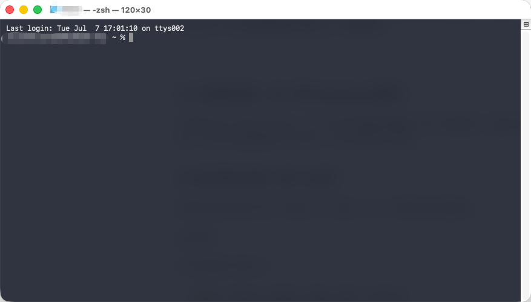

# 快速安装与配置

> **本章定位**：动手章节。不管你是 Mac 还是 Windows，CLI 还是 Desktop，本章带你一步步把 Claude Code 装好、配好、跑通第一次对话。
>
> **预计阅读时间**：15 分钟

---

## 3.1 安装四步走（心里有数）

别被「安装」两个字吓到。整个过程跟装一款新游戏差不多——装运行库 → 装游戏 → 注册账号 → 开玩。

Claude Code 的安装也是四步：

| 步骤  | 做什么                                     |
| --- | --------------------------------------- |
| ①   | **装配套工具**（Git 版本控制 / VS Code 编辑器，都可选）  |
| ②   | **装 Claude Code 本体**（CLI 或 Desktop）     |
| ③   | **搞定付费**（Claude 订阅 或 第三方 API Key）       |
| ④   | **配 Key 连上模型**                          |

💡「简单来说」：① 是可选的准备工作。② 跟装普通软件一样。③ 和 ④ 就是「哪里付钱、哪里填密码」，不用怕。

🔰「新手建议」：如果你读到「Node.js」「环境变量」这种词开始紧张——别怕，这章就是帮你一步步搞定的。**你不需要理解它们是什么，照做就行。**

---

## 3.2 前置准备（CLI 和 Desktop 通用）

不管你选 CLI 还是 Desktop，以下三样东西都是**可选的**（装了体验更好，但都不影响 CC 本体安装）。你可以先直接跳到 3.3 装 CC，回头再回来补这些。

### ⓪ 如何调出终端（新人必读）

如果你以前从没打开过「终端」这个东西，这一小节就是为你准备的。

**macOS：**

打开终端有三种方式：

1. 🖼️ 在「启动台」里找到「终端」图标，点击打开
2. 🖼️ 按 `Cmd + 空格` 或者 `F3` 打开“聚焦搜索”，输入「Terminal」或「终端」，回车
3. 🖼️ 打开访达 Finder → 应用程序 → 实用工具 → 终端

打开后你会看到一个白底黑字或黑底白字的窗口，上面有一行类似 `用户名@MacBook ~ %` 的文字，后面有个闪烁的光标——这就是你可以输入命令的地方。



**Windows：**

- 🖼️ 按 `Win+R` 键，输入「PowerShell」 ，回车
- 🖼️ 右键点击开始菜单 → 选择「Windows PowerShell」或「终端」

打开后你会看到一个蓝底或黑底的窗口，上面写着 `PS C:\Users\你的用户名>` —— 这就是你可以输入命令的地方。

💡「简单来说」：终端就是一个「跟电脑打字说话」的窗口。不用怕它——你只需要把教程里的命令复制粘贴进去，按回车就行。

🔰「新手建议」：第一次打开终端可能会觉得「这东西好可怕」。没关系，把它当成一个只能用键盘操作的聊天窗口。你不会弄坏电脑的——装个软件而已。

### ① Git — 你的「存档系统」（推荐）

Git 是版本控制工具。简单理解就是：它帮你记住每一次文件改动的快照，哪天改错了能一键回滚。

Claude Code 会自动帮你用 Git，你不需要会 Git。但电脑上需要装一个。

- 🖼️ macOS：去 [git-scm.com](https://git-scm.com) 下载安装包，或 `brew install git`
- 🖼️ Windows：同样去官网下载，下载完安装包后一路点击下一步
- 验证：终端输入 `git --version`

Windows 用户前往官网下载过程如图所示：


🔰「新手建议」：把 Git 当成游戏里的「存档 / 读档」功能。不需要学，让它安静待在后台就行。

### ② VS Code（代码相关任务推荐）

VS Code 是微软出的免费编辑器。Claude Code 不强制需要它，但它自带文件树 + 终端 + 编辑器，跟 CC 配合体验最好。

🖼️ 去 [code.visualstudio.com](https://code.visualstudio.com) 下载安装即可。


### ③ Node.js — 只在你走 npm 安装时才需要（多数人可跳过）

⚠️「注意」：**这一节多数人可以跳过。** 3.3 节推荐的官方原生安装脚本（PowerShell / curl 一键装）**不依赖 Node.js**——CC 下载下来是一个自包含的原生二进制，自带运行时。

只有以下两种情况才需要装 Node.js（要求 **v22 或更高**）：

1. 你偏好用 `npm install -g @anthropic-ai/claude-code` 这种方式安装
2. 你需要给 Claude Code 写 MCP 服务器 / hook 脚本，且用 Node.js 编写

**如果确实需要装：**

🖼️ 打开 [nodejs.org](https://nodejs.org) → 下载 LTS 安装包 → 一路点「下一步」→ 装完。


🖥️ 或者用命令行（macOS 用户推荐）：

```bash
# macOS — 用 Homebrew（如果没有 brew，先去 brew.sh 装一个）
brew install node

# 验证装好了没
node --version
# 应该输出类似 v22.x.x
```

🔰「新手建议」：不确定要不要装？先跳过。3.3 节的官方脚本对绝大多数读者已经够用。

---

## 3.3 CLI 安装

好，前置准备做完了。现在装 Claude Code 本体。

### macOS

**推荐：官方一键安装脚本**

打开终端（Terminal），粘贴回车：

```bash
curl -fsSL https://claude.ai/install.sh | bash
```

跟 Windows 一样，脚本会自动下载 macOS 原生的 `claude` 二进制到你的用户目录（`~/.local/bin/claude`），并配好 PATH。**不依赖 Node.js**。

**其他安装方式**（任选一种即可，效果一样）：

```bash
# Homebrew（跟着稳定通道更新，慢一周）
brew install --cask claude-code

# npm（需要预装 Node.js 22+）
npm install -g @anthropic-ai/claude-code
```

装完**关掉当前终端窗口，重新开一个**，然后验证：

```bash
claude --version
```

看到版本号（形如 `2.1.xxx`）就装好了。

🔰「新手建议」：不确定选哪种？就用第一种官方脚本。它是 Anthropic 官方推荐的方式，装好后会自动在后台更新，多数人不用再操心。

### Windows

**Windows 现在支持原生安装，不再需要 WSL。** 网上很多老教程还在教「先装 Ubuntu 再装 CC」——那是 2025 年初的做法，现在可以直接忽略。

**推荐：PowerShell 一键安装**

打开 PowerShell（**不需要**管理员权限），粘贴下面这行回车：

```powershell
irm https://claude.ai/install.ps1 | iex
```

脚本会自动下载 Windows 原生的 `claude.exe` 到你的用户目录，并配好 PATH。

**其他安装方式**（任选一种即可，效果一样）：

```powershell
# WinGet（Windows 11 内置的包管理器）
winget install Anthropic.ClaudeCode
```

```batch
:: CMD 用户
curl -fsSL https://claude.ai/install.cmd -o install.cmd && install.cmd && del install.cmd
```

**装完关键一步**：**关掉当前终端窗口，重新打开一个**。不重开的话 `claude` 命令会提示 `not recognized`——这不是安装失败，是新配置的 PATH 还没在旧窗口里生效。

在新开的终端里验证：

```powershell
claude --version
```

看到版本号（形如 `2.1.xxx`）就装好了。

💡「简单来说」：不用 WSL、也不用 Node.js（Windows 原生安装脚本自己带运行时，3.2 节的 Node.js 是给 macOS/Linux 走 npm 安装方式的读者用的）。整个过程 = 一行 PowerShell + 重开终端。

🔰「新手建议」：分不清自己开的是 PowerShell 还是 CMD？看提示符——`PS C:\` 开头是 PowerShell，`C:\` 开头是 CMD。命令别搞混了，Windows 用户装 CC 出错的第一常见原因就是这个。

⚠️「注意」：如果 3.2 节你已经装了 [Git for Windows](https://git-scm.com/downloads/win)，Claude Code 会自动用它来跑 Bash 命令（体验更接近 macOS）。没装也没关系，CC 会自动回落到 PowerShell，一样能用。

### 第一次启动

**注意，由于相当一部分用户使用的是第三方 API，因此建议使用第三方 API 的用户直接跳转到 [3.5 特别篇：中国用户配置第三方模型](#35-特别篇中国用户配置第三方模型)。**

装好后，在终端输入：

```bash
claude
```

首次启动会引导你登录 Claude 账号（或输入 API Key）。按提示操作即可。

⚠️「注意」：终端报错了别慌。把报错截图发给任意 AI（ChatGPT / 豆包 / Claude 网页版），它都能告诉你哪出了问题、怎么修。这些报错对 AI 来说一眼就能看懂。

---

## 3.4 Desktop 安装

Desktop 的安装跟普通软件一模一样，不需要碰任何命令行。

🖼️ **macOS**：
1. 打开 [claude.ai/download](https://claude.ai/download)
2. 下载 `.dmg` 安装包
3. 双击 → 把 Claude 图标拖进 Applications 文件夹
4. 打开 Claude → 登录 Claude 账号
5. 点击顶部 Tab 栏的 **Code** → 进入 Claude Code Desktop

🖼️ **Windows**：
1. 同样去 [claude.ai/download](https://claude.ai/download) 下载 `.exe`
2. 双击安装 → 一路下一步
3. 登录 → Code Tab


💡「简单来说」：跟你装微信、装 QQ 的操作一模一样。下载 → 双击 → 登录 → 完事。

⚠️「注意」：Desktop 目前只支持 macOS 和 Windows，Linux 用户只能用 CLI。

---

## 3.5 特别篇：中国用户配置第三方模型

这是本章最重要的部分。如果你满足以下任一条件，请仔细读：

- 没有外币信用卡，不想付 $20/月
- 想用国产模型（DeepSeek、豆包、智谱 GLM 等）
- 想先用免费模型体验，再决定是否付费

### 什么是 CC Switch？

CC Switch 是一个开源模型路由器，让你在 Claude Code 里用任何模型——Claude、DeepSeek、豆包、智谱，甚至本地部署的模型都可以。

### 安装 CC Switch

进入官方的github仓库中： https://github.com/farion1231/cc-switch/releases

往下翻，找到最新的发布版本，双击下载后，再双击安装，一路确定即可：


⚠️「注意」：第三方模型的功能可能不完全等同于 Claude 原版（比如某些高级 tool 不支持），但对日常使用影响不大。书的后面章节会标注哪些功能是 Claude 专属的。

### CLI 配置第三方API（以DeepSeek V4为例）

打开CC Switch，你会看到这样的页面：

其中，最上方一栏的左侧标签页，是Claude Code 的 CLI 的标签页，最上方左起第二个标签页是Claude Code Desktop 的配置页面。下面的每一个栏目都是官方 / 第三方API配置选项
。当你第一次打开CC Switch时，只有官方的配置卡片，需要自己新建配置。


我们以DeepSeek V4 来作为案例，配置我们的第三方API。

首先进入Deepseek API 官网平台： https://platform.deepseek.com/

1. 首先点击左侧边栏的「API Keys」
2. 点击「创建 API Key 按钮」
3. 妥善保存自己的API Key，**DeepSeek 的 API Key 只在生成时显示，后续无法找回！**


之后回到 CC Switch，完成后续的配置。记得在配置完成后 **点击「添加」按钮**：

1. 点击橙色的「➕」按钮
2. 选择DeepSeek
3. 填写API Key
4. 往下翻，选择模型映射，**点击「一键设置」**
5. **点击右下角「添加」按钮**


### Desktop 配置第三方API

前面所有步骤与 CLI 配置相同，关键在于最后的步骤，配置模型映射时，需要打开模型映射：


在保存且添加完毕后，**记得一定要开启本地路由！否则配置无法生效：**


---

## 3.6 Desktop 特别篇：Claude 订阅与额度

Desktop 默认绑定 Claude 官方订阅，模型下拉菜单只显示 Claude 官方模型（Opus、Sonnet、Haiku 等），**不支持通过 CC Switch 切换到第三方模型**。如需使用国产模型，请通过 CLI 配置。

### 套餐对比

| 套餐 | 月费 | 适用人群 |
|------|------|---------|
| **Free** | 免费 | 仅网页端可用，每天只能进行几次对话，适合初步了解 |
| **Pro** | $20/月 | 个人轻度使用，日常对话和简单任务 |
| **Max 5x** | $100/月 | 中度个人使用或开发场景，额度是 Pro 的 5 倍 |
| **Max 20x** | $200/月 | 重度开发使用，适合高频使用 Claude Code 的开发者 |
| **Team** | 按人数 | 企业团队，集中管理和计费 |

### Token 额度怎么看

Claude Code Desktop 界面顶部状态栏会显示当前用量。大致参考：

- Free 用户只能在网页端（claude.ai）进行简单对话，不能使用 Claude Code
- Pro 用户可以使用 Claude Code，但额度适合轻度使用
- Max 5x 用户额度是 Pro 的 5 倍，适合日常开发
- Max 20x 用户额度最充裕，适合重度开发和频繁使用

🔰「新手建议」：想体验 Claude Code，至少需要 Pro 订阅。如果日常开发频繁使用，建议直接上 Max 5x。

---

## 3.7 验证安装

不管装的 CLI 还是 Desktop，来跑一次对话确认一切正常。

🖥️ **CLI**：打开终端，输入：

```bash
claude -p "你好，用一句话介绍你自己"
```

如果返回了一段 Claude 的自我介绍 → ✅ 安装成功。

🖼️ **Desktop**：打开 Claude → 点 Code tab → 输入框里打「你好」→ 回车。

如果回复了 → ✅ 安装成功。

⚠️「注意」：如果没成功，最常见的三个问题：

1. **`claude: command not found`** → 按你的安装方式对号入座：
   - 走 PowerShell / curl 官方脚本：**关掉终端重开一个**（PATH 需要重新加载），仍然不行就检查 `~/.local/bin`（macOS/Linux）或 `%USERPROFILE%\.local\bin`（Windows）是否在 PATH 里
   - 走 npm：Node.js 没装或 npm 全局路径没配好，回到 3.2 ③ 检查 Node.js
   - 走 Homebrew：`brew doctor` 排查
2. **API Key 无效** → 第三方 Key 打错了或没充值，回到 3.5 确认 Key 正确
3. **网络超时** → 国内访问海外 API 可能被墙，需要开代理或换国内模型

---

## 本章要点

- ✅ 安装 = 四步走：配套工具（可选）→ CC 本体 → 付费 → Key
- ✅ 前置准备都是可选的：Git（存档系统）、VS Code（编辑器）、Node.js（仅 npm 安装方式需要）
- ✅ CLI：官方原生安装脚本一行命令搞定（不依赖 Node.js），`claude` 启动，支持第三方模型
- ✅ Desktop：下载安装包 → 登录 → Code Tab，跟装普通软件一样
- ✅ 中国用户省钱方案：CC Switch + DeepSeek / 智谱，¥10 块钱用很久
- ✅ 装完验证：`claude -p "你好"` 或 Desktop 发一条消息

---

*下一章我们将认识 Claude Code 的界面和基本操作。你已经装好它了，现在来学会怎么用它。*
